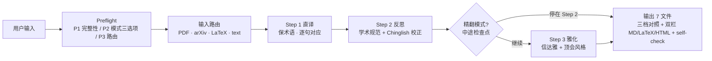

# 学术翻译 Skill

**直译 → 反思 → 雅化** · 公式零损伤 · 顶会术语库 · 双栏对照

## 工作流概览



## 输入参数（结构化契约）

主流程的所有可控参数集中在 Preflight P1（输入完整性）和 P2（三选项）。下表是机器可读的契约规格——用户没显式说时按"默认"列处理，并以「⚙️ 已应用配置」展示给用户一次回退机会。

| 参数 | 类型 | 必填 | 默认 | 取值 / 说明 |
|---|---|:-:|---|---|
| `input_kind` | enum | ✅ | 自动检测 | `pdf` / `arxiv_id` / `latex` / `markdown` / `text`；P1 完整性检查决定 |
| `direction` | enum | 否 | 按输入语言推断 | `zh2en` 中→英（投稿）/ `en2zh` 英→中（理解）/ `bilingual` 双向对照 |
| `depth` | enum | 否 | `standard` | `quick`（仅 Step 1，~1× 时间）/ `standard`（Step 1+2，~2.5×，**日常推荐**）/ `full`（Step 1+2+3，~4×，投稿必选）|
| `glossary_mode` | enum | 否 | `builtin` | `builtin` 仅内置顶会术语库 / `user` 仅用户上传术语库 / `merged` 双方合并（推荐有领域术语时）|
| `target_venue` | string | 否 | 自动推断或 `ml` | `ml` / `nlp` / `cv` / `ir` 之一；决定 Step 1 加载哪份 `glossary/{venue}.md` |
| `output_dir` | path | 否 | `translation-output/{ISO-time}-{paper-slug}/` | 用户可指定，但**绝不**写入用户原始文件路径 |

**输出契约**（参考下方 §「输出 — 三档对照 + 双栏对照」详细 schema）：

| 字段 | 类型 | 默认存在的模式 |
|---|---|---|
| `output_files` | list[str] | quick→{01,06} / standard→{01,02,04,06,07} / full→{01,02,03,04,05,06,07} |
| `provenance.coverage_pct` | float [0,1] | 全模式存在；理想 ≥ 0.95 |
| `preserve_latex.verify_passed` | bool | 含 LaTeX 输入时存在；false → 阻断输出 |
| `terms_hit_rate` | float [0,1] | 全模式存在；术语库命中率 |

**异常时的输出形态**：见下方 §「异常与边界条件」表格。所有阻断场景都会额外生成 `ERROR.md`，把原始输入 + 失败原因写入 `output_dir`，**绝不**静默退出。

---

## 不在范围内（请改用其他工具）

学术翻译追求"术语精确 + 公式零损伤 + 投稿规范"，因此对以下场景**故意做得不好**——它们各自有更合适的工具。**遇到下表场景时立即拒绝并推荐对应工具，不要尝试翻译**：

| 场景类型 | 典型输入 | 推荐替代工具 | 拒绝原因 |
|---|---|---|---|
| **通用文本 / 邮件 / 新闻** | "尊敬的 X 总" / "Today's headline" | **DeepL** / **沉浸式翻译** | 学术 Skill 会强行套用顶会风格表达（如 "We propose"），破坏商务/口语语气 |
| **代码注释 / Commit msg / i18n** | `// Calculate sum of array` | 通用机翻或代码翻译工具 | 短上下文，本 Skill 的 Provenance 三维度 + 6 文件输出是过度设计 |
| **产品 UI / 营销文案** | "Buy now! Save 50%" | 通用 i18n 工作流工具 | 需要 i18n 工作流 + 文化适配 |
| **视频字幕** | 含时间码 `00:01:23` | 字幕专用工具 | 时间码处理 + 口语风格 |
| **扫描件 PDF**（无文本层）| 纯图片论文 PDF | 先用 OCR 工具，再回本 Skill | OCR 在公式/数字上幻觉率高，输出会"看似合理但数据错乱" |
| **法律 / 医学专业级** | 合同 / 病例 / 处方 | AI + 人工 verify 工具 | 法律医学错译有真实代价，需人工校对 |
| **诗词 / 文学押韵** | 王维"空山新雨后" | 诗词专用工具 | 本 Skill 的"信达雅"针对论文，不针对意境 / 押韵 |

**关键自检**：用户输入命中上表任一行时，**绝不**进入 Preflight P2 / 三步翻译流程，直接展示"这属于 X 类场景，建议用 Y 工具，原因是 Z"。

## ⛔ Preflight（任何翻译前的开场白）

读取本 Skill 后，按以下顺序完成 Preflight。这一段看起来繁琐，但跳过其中任何一步都意味着接下来 4 倍时间的精翻可能跑偏方向，得不偿失。

### Step P1：输入完整性

| 输入类型 | 检查项 | 失败处理 |
|---|---|---|
| PDF 文件 | 路径存在 + 文本层可提取（非扫描件） | 跑 `scripts/extract_pdf.py --check {path}` 提示用户 |
| arXiv ID | 格式 `YYMM.NNNNN` 或旧式 `arch-ive/YYMMNNN` | 失败 → 询问用户重新提供 |
| LaTeX 源 | 含 `\documentclass` 或 `\begin{document}` | 失败 → 当作普通文本处理但提示 |
| 粘贴文本 | 字符数 ≥ 50 | 失败 → 询问是否要翻译这么短的内容 |
| Markdown | 文件存在或粘贴 | — |

### Step P2：模式 + 方向 + 术语库三选项澄清

学术翻译的成本差异很大——快速模式只跑直译（≈1× 时间），精翻模式三步全跑（≈4× 时间）。模型不能替用户决定花多少时间。所以这里必须让用户自己选；用户没说时给出默认值并展示「⚙️ 已应用配置」让对方有一次回退机会。

```
✋ 翻译前请确认 3 个选项：

1. 翻译方向：
   [a] 中 → 英（投稿 / 国际期刊）
   [b] 英 → 中（理解 / 文献综述）
   [c] 双向（生成中英对照版）

2. 输出深度：
   [a] 快速（仅 Step 1 直译，约耗 1×时间，适合快速理解原意）
   [b] 标准（Step 1+2 直译+反思，约耗 2.5×时间，**推荐日常使用**）
   [c] 精翻（Step 1+2+3 直译+反思+雅化，约耗 4×时间，投稿/发表必选）

3. 术语库：
   [a] 仅用内置顶会术语库（refs/glossary/）
   [b] 用户上传自定义术语库（粘贴 / 文件）
   [c] 内置 + 自定义合并（推荐有领域术语时）
```

> 用户不指定时默认 1=按输入语言推断 / 2=标准 / 3=仅内置，但要在输出前以「⚙️ 已应用配置」展示给用户。
>
> 如果用户选 `2c 精翻`，额外提示一句："精翻会在 Step 2 → Step 3 之间暂停一次，让你确认术语和直译质量"——这呼应下文的中途检查点。

### Step P3：路由

> **⚠️ 路由 = 加载触发器**：进入对应分支前，**必须**通过 Read 工具读取标 `📖 MANDATORY` 的文件再开始执行；标 `📖 按需` 的仅在该子情境出现时加载。
> 不读 = 走的是空壳分支，下游所有"按 references 规则"的判断都没有依据。

| 用户意图 | 路由模块 + 加载触发器 |
|---|---|
| "翻译这个 PDF / arxiv 论文" | 📖 **MANDATORY**: [modules/input-router.md](modules/input-router.md) → 三步翻译 |
| "把这段中文翻成英文" / "translate to English" | 📖 **MANDATORY**: [modules/input-router.md](modules/input-router.md) `text` 分支 |
| "翻译并保留公式" / "保留 latex 翻译" | 📖 **MANDATORY**: [modules/input-router.md](modules/input-router.md) `latex` 分支 + 📖 **MANDATORY**: [refs/formula-preservation.md](refs/formula-preservation.md) |
| "中英对照" / "bilingual" | 三步翻译 + 📖 **MANDATORY**: [modules/bilingual-export.md](modules/bilingual-export.md) |
| "精翻" / "投稿翻译" / "雅化" | 三步翻译全开 + 📖 **MANDATORY**: [modules/academic-polish.md](modules/academic-polish.md) + 📖 按需: [refs/anti-ai-patterns.md](refs/anti-ai-patterns.md) |
| "快翻" / "快速翻译" / "粗翻" | 仅 Step 1（不加载 polish / chinglish-patterns） |
| "用我的术语库翻" / "自定义术语" | 📖 按需: [config/user-glossary.template.yaml](config/user-glossary.template.yaml) |
| "校对译文" / "review my translation" | 跳 Step 1，从 Step 2 进入 + 📖 **MANDATORY**: [refs/chinglish-patterns.md](refs/chinglish-patterns.md) |

---

## 核心方法 — 三步翻译法

> 设计思路：把翻译流水线拆为「直译 → 反思 → 雅化」三步，每一步都有独立的目标和检查点，是学术翻译领域的成熟范式。

三步法的关键洞察是**把"忠实"和"流畅"解耦**——人脑同时追求两者会让 LLM 在某一句"为了流畅丢了精度"。先逐句忠实直译（Step 1），再以全文视角校学术规范和术语一致性（Step 2），最后才追求文笔（Step 3）。中间产物全部保留，便于 diff 和回退。

### Step 1 — 直译（保术语·逐句对应）

> 📖 **加载触发器**：进入 Step 1 前，**MANDATORY** 读取与目标会议匹配的术语库一份（按用户输入推断或 P2 选择）：
> - ML 顶会 → [refs/glossary/ml-venues.md](refs/glossary/ml-venues.md)
> - NLP 顶会 → [refs/glossary/nlp-venues.md](refs/glossary/nlp-venues.md)
> - CV 顶会 → [refs/glossary/cv-venues.md](refs/glossary/cv-venues.md)
> - IR/Web/Data → [refs/glossary/ir-data-venues.md](refs/glossary/ir-data-venues.md)
>
> 用户未指定会议时默认加载 `ml-venues.md`（最通用）。同时检测 LaTeX 标记 → 触发 `📖 MANDATORY: refs/formula-preservation.md`。

**目标**：忠实传达原意，保留所有专业术语、公式、引用，**不追求流畅**。

**强制规则及理由**：
1. 公式（`$...$` / `\\begin{equation}` / `\\[...\\]`）原样保留——它们是 LaTeX 编译产物，翻译会破坏排版且没有"译法"
2. `\\cite{}` / `\\ref{}` / `\\eqref{}` / `\\autoref{}` 原样保留——这些是引用键，翻译后会让交叉引用全部断裂
3. 专业术语优先用 [refs/glossary/](refs/glossary/) 中的标准译法；术语库未覆盖时保留原文 + 在括号附译法（例 "embedding（嵌入）"），方便读者反向查阅
4. 数字 / 单位 / 化学式 / 算法名原样保留——这些是数据事实，翻译只会引入错误
5. 段落结构（句子边界）保持 1:1 对应——便于 Step 2 反思阶段做对齐
6. **表格保留 = 结构原样 + 表头/数据不翻译 + 仅 caption 翻译**——这是高频踩坑点，独立成条说明：
   - Markdown 管道符表格 `| col1 | col2 |` / `|---|---|` 的**分隔符行、列对齐、表格行数列数**全部原样保留
   - 表头（header row）、数据单元格中的**数字 / 公式 / 模型名 / 数据集名 / 缩写**一律不翻译（与 §核心原则 3 的"不变量"一致）
   - 表格上方/下方的 `Table N: ...` caption 或紧邻段落属于自然语言，**只翻译 caption**
   - 输入是 PDF 时，`paragraph_kind == "table"` 的 segment **整段绕过翻译模型**，仅 `paragraph_kind == "caption"` 走三步流程
   - 输入是 LaTeX 时，`\begin{table}...\end{table}` 块整段被 `<TABLE_n>` 占位符替换（见 [refs/formula-preservation.md](refs/formula-preservation.md)）
   - 输入是 Markdown 时，对管道符表格识别为"表格 segment"，整体替换为 `<MDTABLE_n>` 占位符，仅 caption 走翻译；输出阶段还原
   - **底线检查**：Step 1 输出后扫描原文表格行数 ≥ 1 的情况，若译文表格行数 ≠ 原文 → 阻断该段，重跑或标记 `manual_review`

**输出格式**：每段译文带 Provenance 标注：

```yaml
- segment_id: §3.2-p1
  source_page: 7
  source_section: "3.2 Method"
  source_excerpt: "We propose a novel..."
  step1_literal: "我们提出一种新颖的..."
  preserved:
    formulas: ["$\\mathbf{x}_t = f(\\mathbf{x}_{t-1})$"]
    citations: ["\\cite{vaswani2017attention}"]
    terms_kept_en: ["embedding", "MLP"]
```

### Step 2 — 反思（学术规范 + Chinglish 校正 + 术语一致性）

> 📖 **加载触发器**（中→英 翻译方向时 MANDATORY；英→中 时 📖 按需）：
> - **MANDATORY**: [refs/chinglish-patterns.md](refs/chinglish-patterns.md)（中→英反思阶段唯一权威）
> - **MANDATORY**: [refs/section-conventions.md](refs/section-conventions.md)（学术规范替换）
> - 按需: [refs/anti-ai-patterns.md](refs/anti-ai-patterns.md)（精翻模式才必读）

**目标**：检查直译产生的不自然表达，应用学术规范，确保术语一致。

**4 个反思维度**（每段都要逐项检查）：

| 维度 | 规则来源 | 典型问题 → 修正 |
|---|---|---|
| **学术规范** | [refs/section-conventions.md](refs/section-conventions.md) | "我们做了实验显示..." → "实验结果表明..." |
| **Chinglish 校正**（中→英时） | [refs/chinglish-patterns.md](refs/chinglish-patterns.md) | "in recent years" 滥用 → "recently" / 删除 |
| **去 AI 味** | [refs/anti-ai-patterns.md](refs/anti-ai-patterns.md) | "在本文中，我们..." 滥用 → 视语境精简 |
| **术语一致性** | [refs/glossary/](refs/glossary/) + 用户术语库 | 同一术语在 §1 译"嵌入"、§3 译"嵌入向量" → 全文统一 |

**两条硬约束的理由**：
- 术语一致性扫描必须**全文级**而非段内——读者跨章节查同一概念时，译法不一致会被直接误判为两个东西
- 任何修改保留 Step 1 → Step 2 的 diff 可见——用户回看时能准确知道反思阶段做了什么、是否有改过头

详见 [modules/three-step-translation.md](modules/three-step-translation.md) 的反思阶段算法。

### Step 3 — 雅化（信达雅 + 顶会风格）

> 📖 **加载触发器**（精翻模式 2c MANDATORY，标准模式 2b 不进 Step 3 不加载）：
> - **MANDATORY**: [refs/word-choice-table.md](refs/word-choice-table.md)（顶会动词替换表）
> - **MANDATORY**: [refs/anti-ai-patterns.md](refs/anti-ai-patterns.md)（去 AI 味规则，雅化阶段最易引入 AI 腔）
> - 按需: 与目标会议匹配的 `refs/glossary/{venue}.md`（已在 Step 1 加载，复用即可）

**目标**：在 Step 2 已规范的基础上，提升流畅度、紧凑度、可读性，达到投稿级。

**3 个雅化维度**：

| 维度 | 规则来源 | 例 |
|---|---|---|
| **信达雅** | 译文要"信"（忠实）、"达"（通顺）、"雅"（优美） | "本研究展示了..." → "本研究表明..." |
| **顶会风格**（CS 顶会偏好） | [refs/word-choice-table.md](refs/word-choice-table.md) | "utilize" → "use", "demonstrate" → "show", "a plethora of" → "many" |
| **段落级流动** | [refs/section-conventions.md](refs/section-conventions.md) | 加逻辑连接词（however / thus / nonetheless），消除"句子的水滴" |

**目标会议适配**（用户指定时）：

| 会议域 | 风格特点 | 引用此 Glossary |
|---|---|---|
| ML（NeurIPS/ICLR/ICML/AAAI/IJCAI） | 简洁、公式重、数学化语言 | `glossary/ml-venues.md` |
| NLP（ACL/EMNLP/NAACL） | 语言学精度、相关工作详尽 | `glossary/nlp-venues.md` |
| CV（CVPR/ICCV/ECCV） | 视觉术语精确、benchmark 表达规范 | `glossary/cv-venues.md` |
| IR/Web/Data（SIGIR/WWW/KDD/CIKM） | 问题动机、实用 impact 强 | `glossary/ir-data-venues.md` |

**Step 3 收尾自检**（理由：雅化阶段最容易"改过头改丢内容"，这五项是底线）：
- ✅ Provenance 仍可追溯到 Step 1 的源段落
- ✅ 公式、`\\cite{}`、`\\ref{}` 一字未改
- ✅ 数字 / 实验结果 / 数据集名 一字未改
- ✅ 用户自定义术语库的强制术语 100% 命中
- ✅ **表格行数 / 列数 / 数据单元格内容**与原文严格一致；只允许 caption 被翻译
- ✅ **`07-bilingual.html` 必须存在**且 `scripts/preserve_latex.py --verify --html` 通过——HTML 是双栏对照的默认主交付物，缺失 = 输出失败

---

## 🛑 中途检查点（精翻模式必经，标准/快速模式跳过）

**触发**：用户在 Preflight P2 选了 `2c 精翻`。  
**位置**：Step 2 完成后、Step 3 开始前。  
**为什么需要它**：精翻三步成本接近快速模式 4 倍。如果 Step 2 的术语和直译方向已经偏了，再花 1.5× 的成本跑 Step 3 雅化只会把错误"包装得更精美"。前移检查点的代价远小于事后重跑。

### 必做动作

1. **阻断流程**——不要自动进入 Step 3，等待用户输入。
2. **展示三件物**给用户：
   - 📊 **Step 1 → Step 2 diff 摘要**：被反思阶段改写的段落数 / 术语统一替换数 / Chinglish 修正数 / 去 AI 味命中条数
   - 📋 **抽样段对照**：随机抽 2-3 段，展示 `step1_literal` vs `step2_academic` 并排对照
   - 📚 **术语命中表**：本文出现的术语 × 当前选用译法 × 来源（内置 glossary / 用户术语库 / 模型推断）
3. **三选项询问**（措辞统一）：
   ```
   ✋ Step 2 完成。是否进入 Step 3 雅化？
      [a] 继续雅化（采用当前术语和直译）
      [b] 修订后再雅化（你给我术语/段落级修改意见，我应用后再问你一次）
      [c] 就停在 Step 2（不雅化，只输出 01 + 02 两份文件）
   ```
4. **选项 b 的回环**：应用用户修改 → 重新跑 Step 2 反思一致性 → 再回到本检查点询问，最多 3 轮，超出后让用户在 a/c 之间二选一（防止无限改）。
5. **选项 c 的输出收敛**：标记 `output_files = [01, 02, 04, 06, 07]`（跳过 03 雅化和 05 LaTeX 投稿版；07 HTML 仍生成，顶栏标 "学术规范版（未雅化）"），并在 `06-self-check.md` 注明"用户在 Step 2 后停止"。

### 这里不要做的事（理由）

- ❌ 不要把"是否继续"问题与 P2 的三选项合并提问——P2 在翻译前问，本检查点在 Step 2 后问，时机不同，合并会让用户在没看到译文的情况下被迫决策
- ❌ 不要静默跳过该检查点（哪怕用户在 P2 时勾过"全自动"）——本检查点优先级高于自动化偏好，因为它是发现"翻译跑飞"的最后机会
- ❌ 不要在该检查点修改公式 / `\\cite{}` / Provenance（这些是不变量，下文会展开）

> 标准模式（2b）不强制本检查点，但建议在 Step 2 完成后**主动**展示一次 diff 摘要供用户参考；快速模式（2a）不进入本检查点。

---

## 输出 — 三档对照 + 双栏对照（默认全产）

> ⚠️ **强约束**：standard / full 模式下 **`07-bilingual.html` 必须生成**——它是双栏对照的默认主交付物（用户最常打开的就是 HTML，因为有公式渲染 + 视图切换 + 段落复制）。  
> 跳过 07 = 输出残缺 = 视为生成失败。常见误区：模型只产 Markdown 就停手；本 Skill 显式禁止此行为。  
> 若运行环境不支持写 HTML（极少见），必须在 `06-self-check.md` 顶部红字标注"HTML 未生成，原因 = X"，**不允许静默跳过**。

每次精翻调用都生成 7 个文件（默认放在 `translation-output/{timestamp}-{paper-id}/`）：

| 文件 | 用途 | 必出模式 |
|---|---|---|
| `01-step1-literal.md` | Step 1 直译初稿 | quick / standard / full |
| `02-step2-academic.md` | Step 2 学术规范版 | standard / full |
| `03-step3-polished.md` | Step 3 信达雅终稿 | full |
| `04-bilingual.md` | 双栏对照（左原文 / 右终稿）| standard / full |
| `05-bilingual.tex` | LaTeX 双栏（投稿用） | full |
| `06-self-check.md` | 自检报告（术语命中率 / 公式保留率 / 表格保留率 / Provenance 完整性 / **HTML 生成状态**） | quick / standard / full |
| `07-bilingual.html` | 双栏 HTML（浏览器即开 + MathJax + 视图切换 + 复制 + **表格原样渲染**）| **standard / full（必出）** |

**生成顺序**：先 01→02→03 三档对照 → 再衍生 04（双栏 MD）→ 05（双栏 LaTeX）→ **07（双栏 HTML，必出）** → 最后 06（自检报告，含 07 是否生成的状态）。  
**收尾断言**：所有应出文件未出齐时，模型必须显式向用户报错「输出不完整：缺少 X」并给出补救方案，**不允许沉默交付**。

模板见 [assets/templates/](assets/templates/)。HTML 渲染契约详见 [modules/bilingual-export.md](modules/bilingual-export.md#文件-07--双栏-html浏览器打开即用)。

---

## 核心原则

### 1. 不修改用户原文件

读取原文 + 写到独立目录是基本契约。即使用户说"在原文上改"，也要写到 `translation-output/` 后告知用户——他们随时可能想回头比较译稿和原文，原地改会让这个动作不可逆。

### 2. Provenance 三维度（防幻觉护城河）

每段译文必须可追溯到：
1. **页码 / 行号**（PDF 来源）
2. **章节标题**（`§3.2 Method`）
3. **原文 excerpt**（≥ 30 字，便于 ngram 校验）

为什么三维度都要：单靠"页码"会被分页错位干扰、单靠"章节"无法定位到段、单靠 excerpt 在长论文里可能多次匹配。三维度组合让 hallucination 几乎无处遁形。

### 3. 公式与引用是不变量（IDEMPOTENT）

公式、`\\cite{}`、`\\ref{}`、`\\eqref{}`、算法块、数据集名、数字——这些是论文中"不存在译法"的元素。Step 3 输出前 `scripts/preserve_latex.py --verify` 会自动校验；校验失败 → 阻断输出，回退到 Step 2 重跑。这是底线，因为一旦这些被翻动，整篇论文的 LaTeX 编译和交叉引用全会崩。

### 4. 渐进式披露（按需加载）

本文件只做路由 + 原则 + 三步法概述。详细工作流在 `modules/*.md`，术语库 / 模式表在 `refs/`，通用脚本在 `scripts/`。

### 5. 多 provider 切换（鲁棒性）

支持多个 LLM provider 互为兜底，并保留对外部"AI + 人工 verify"工具的转交路径：

| Provider | 用法 | 强项 |
|---|---|---|
| **Claude（默认）** | 当前 Skill 的执行环境 | 长文本 + 学术语境 |
| OpenAI GPT | 用户指定时 fallback | 通用翻译 |
| Gemini | 用户指定时 fallback | 多模态（PDF 图） |
| DeepL API | 用户提供 key 时 | 欧洲语言对 |
| AI + 人工校对工具 | 用户指定时 | 法律 / 医学 / 投稿前最终把关 |

详见 [modules/provider-fallback.md](modules/provider-fallback.md)（按需创建，当前默认 Claude）。

### 6. 容易做错的几件事（写出来是为了让模型避开陷阱）

- **跳 Step**：精翻三步缺一会让术语不一致和 Chinglish 残留——Step 2 是术语全文统一的唯一时机
- **翻译公式**：LaTeX 公式、`\\cite{}`、数字、算法名属于"非自然语言"——动它们 = 编译失败
- **翻译表格 / 把表格弄丢**：管道符表格 `| ... |` 经过翻译模型会被改写成纯文本段落、表头变成中文、行列对不齐——必须按 Step 1 强制规则第 6 条**整段占位符化**，仅 caption 走翻译；输出阶段还原
- **HTML 不生成 / 静默跳过 07**：standard/full 模式下 `07-bilingual.html` 是默认主交付物，模型常误以为"只产 Markdown 就够了"——跳过 = 视为输出失败，必须在 06-self-check 中显式标注或补出
- **自行决定模式**：精翻和快速模式成本差 4 倍，模型替用户猜错会浪费用户时间或漏译质量，所以 P2 不能跳
- **改写用户原文件**：所有产出走 `translation-output/`——保留原文是事后审计和回退的前提
- **术语库未加载就声称"已应用顶会术语"**：加载失败必须明确提示，否则用户被误导
- **Step 3 改动 Step 2 已对齐的 Provenance**：会破坏 diff 可追溯性，雅化只调措辞不改锚点
- **扫描件 PDF 当文本层处理**：OCR 在公式和数字上幻觉率高，必须先 OCR 校验再交给本 skill

### 6.1 反模式 Bad → Good 示例（最容易出错的 4 类）

> 文字描述容易让模型"知道但做不到"——下面 4 条配对示例是真实踩坑后总结出来的，看一眼差异就能记住边界。

**❌ Bad — 翻译 `\cite{}`**：
```
原文：following \cite{vaswani2017attention}, we adopt the Transformer architecture.
输出：参照 Vaswani 等（2017）提出的方法，我们采用了 Transformer 架构。
问题：\cite{} 引用键被拆解为「Vaswani 等（2017）」，原 LaTeX 文档此处的交叉引用全部断裂，编译后 PDF 的引用列表会缺失这一条。
```

**✅ Good — 保留 `\cite{}` 原样 + 自然语序整合**：
```
原文：following \cite{vaswani2017attention}, we adopt the Transformer architecture.
输出：参照 \cite{vaswani2017attention}，我们采用了 Transformer 架构。
关键：引用键作为不可见占位符整体保留，BibTeX 编译后自然显示为正确的引用形式。
```

---

**❌ Bad — 解释公式语义**：
```
原文：The loss is $\mathcal{L} = -\sum_{t=1}^T \log p(y_t|y_{<t}, x; \theta)$.
输出：损失函数 $\mathcal{L} = -\sum_{t=1}^T \log p(y_t|y_{<t}, x; \theta)$（即对所有时间步 t=1 到 T，对条件概率取对数后求和再取负）。
问题：括号内的语义解释属于"模型自作主张的注释"，原文没有，会污染 source-of-truth；并且数学符号读者本就懂，注释是冗余。
```

**✅ Good — 公式零修饰**：
```
原文：The loss is $\mathcal{L} = -\sum_{t=1}^T \log p(y_t|y_{<t}, x; \theta)$.
输出：损失函数为 $\mathcal{L} = -\sum_{t=1}^T \log p(y_t|y_{<t}, x; \theta)$。
关键：公式只搬运不解释，需要解释时让原文作者在另起的"释义段"里写。
```

---

**❌ Bad — 中→英翻译保留 Chinglish 重复**：
```
原文：近年来，大语言模型展示了显著的能力。然而，近年来其计算成本依然高昂。
输出：In recent years, large language models have demonstrated remarkable capabilities. However, in recent years their computational cost remains high.
问题：原文两次「近年来」是中文写作的允许重复，但英文学术写作中 "in recent years" 重复出现是典型 Chinglish 标志，会被审稿人扣分。
```

**✅ Good — Step 2 反思阶段消除重复**：
```
原文：近年来，大语言模型展示了显著的能力。然而，近年来其计算成本依然高昂。
输出：Recently, large language models have shown remarkable capabilities. However, their computational cost remains high.
关键：保留首句的「Recently」（用 recently 替代啰嗦的 in recent years），第二句省略时间状语让转折更紧凑——这是 refs/chinglish-patterns.md 中明确列出的高频修正项。
```

---

**❌ Bad — 直接翻译商务邮件（超范围）**：
```
用户输入："帮我翻译这封邮件给客户：尊敬的张总，您好！感谢您百忙之中..."
错误处理：直接走 Preflight P2 三选项 → Step 1 直译 → 输出英文邮件
问题：本 Skill 的"信达雅 + 顶会风格"会强行套用学术语气（如把"百忙之中"翻成 "in your busy schedule of important matters"），破坏商务邮件的礼貌客套，反而不如 DeepL 自然。
```

**✅ Good — 范围检测先行**：
```
用户输入："帮我翻译这封邮件给客户：尊敬的张总..."
正确处理：识别"邮件"+"尊敬的"为「不在范围内」表格第 1 行的命中信号 → 立即拒绝并展示：
  「这属于通用商务文本，建议用 DeepL 或沉浸式翻译。
   原因：本 Skill 的顶会风格规则会破坏商务礼貌语气，反而不如通用机翻自然。」
关键：超范围拒绝不是失败，是设计——拒绝后用户得到正确推荐，比强行翻译更有价值。
```

---

## 🚧 异常与边界条件

流程假设环境理想，但翻译实操常遇异常。以下预定义 fallback，保证 skill 不会"一跑就卡住"，也不会静默失败误导用户。

| 场景 | 触发条件 | 处理动作 |
|---|---|---|
| **PDF 文本层为空 / 扫描件** | `scripts/extract_pdf.py --check` 文本字符数 < 200 或图像比 > 80% | 阻断翻译，告知用户「检测到扫描件，OCR 在公式/数字上幻觉率高」，给三选项：[a] 你提供文本层 PDF [b] 你确认接受 OCR 风险（标注 `provenance.ocr_warning=true`）[c] 终止 |
| **PDF 加密 / 受密码保护** | `pdfplumber` / `pypdf` 抛 `PdfReadError` | 询问用户密码并临时解密到内存，不写回原文件；用户拒绝则终止本次任务 |
| **arXiv 下载失败** | `scripts/arxiv_fetch.sh` 非 0 退出 / 网络超时 / 404 | 重试 1 次（指数退避）；仍失败询问 [a] 用户改贴 abs URL [b] 用户上传 PDF 替代 [c] 终止；不要静默切到 PDF 兜底 |
| **`preserve_latex --verify` 失败** | 译文中占位符未还原 / 数字被改写 / 公式被翻译 | 阻断输出。展示具体失败 token 给用户，回退到 Step 2 重跑反思阶段（最多 2 次）；2 次仍失败 → 标注 `output_files += [ERROR.md]`，让用户人工修订 |
| **段落 1:1 对应失败** | Step 1 输出段落数 ≠ 输入段落数（合并/拆分句子） | 该段单独重跑 Step 1，强化 Prompt 中"保持句子边界"约束；连续 2 次失败 → 标记该段 `paragraph_kind="manual_review"`，跳过 Step 2/3 等用户处理 |
| **术语库加载失败** | YAML 解析错误 / 文件不存在 / 内置 + 自定义有冲突 | 不要静默继续。明确提示「术语库加载失败：{原因}」；冲突时展示冲突术语列表让用户选 keep [内置] / [自定义] / [双语并列]；解析错误 → 退化为不带术语库运行并在 `06-self-check.md` 标注 |
| **`translation-output/` 目录已存在同 paper-id 产物** | 同 ISO-time 内重复触发 / 同 paper-id 翻译过 | 不覆盖。在目录后追加 `-r2 / -r3` 后缀新建；同时在新目录 `00-history.md` 写明上次产物路径，便于用户 diff |
| **LLM 上下文超限** | 单段 + glossary + 系统 prompt 超 token 上限 | 自动按句号切分该段为子段，分别翻译后拼接；拼接后重跑 Step 1 自动校验；若切分后仍超限 → 标记该段 `manual_review` 并告知用户 |
| **`config/user-glossary.template.yaml` schema 不符** | 用户上传的术语表缺必需字段 / 字段类型错 | 不要静默丢弃整个文件。逐条校验，合法条目正常加载，非法条目集中报告给用户「以下 N 条术语被忽略：{list}」 |
| **输出体积超 150% 警戒** | 三档对照 + 双栏总字符数 > 原文 1.5× | 多数为正常（学术英文译中文常 1.3-1.5×）；> 2.0× 才告警，提示用户检查是否雅化阶段过度添加了解释 |
| **表格丢失 / 表格被翻译** | 译文中表格行数 < 原文 80% / 表格分隔符行 `\|---\|` 缺失 / 表头被中文替换（数据列名通常应保持原文） | 阻断该段输出。回退到 Step 1 重跑该段时强制走"表格整段占位符化"路径（仅翻译 caption）；连续 2 次失败 → 标 `manual_review`，并在 06-self-check 列出所有受影响表格 |
| **`07-bilingual.html` 未生成** | standard / full 模式下 `output_dir/07-bilingual.html` 不存在 | 视为输出失败。先尝试基于 `04-bilingual.md` + 模板 `assets/templates/bilingual-html.html` 重新渲染一次；仍失败 → 在 `06-self-check.md` 顶部红字标"HTML 生成失败：{原因}"，并提示用户「请明确说『生成 HTML』后我可重试」，**不允许沉默交付** |

**原则**：异常先告知用户、再按规则处理；任何 fallback 路径都要在 `06-self-check.md` 中留痕，便于用户审计。

---

## 模块概览

| 模块 | 职责 | 文件 |
|---|---|---|
| **输入路由** | 分流 PDF / arXiv / LaTeX / text，章节切片 + Provenance | [modules/input-router.md](modules/input-router.md) |
| **三步翻译** | 直译 → 反思 → 雅化的算法实现 | [modules/three-step-translation.md](modules/three-step-translation.md) |
| **学术润色** | 顶会风格 + Chinglish 校正 + 去 AI 味 | [modules/academic-polish.md](modules/academic-polish.md) |
| **双栏导出** | 中英对照 / 三档对照 / LaTeX 渲染 | [modules/bilingual-export.md](modules/bilingual-export.md) |

## 参考资料

| 类别 | 文件 |
|---|---|
| 顶会术语库 | [refs/glossary/](refs/glossary/) |
| Chinglish 模式 | [refs/chinglish-patterns.md](refs/chinglish-patterns.md) |
| Word Choice 替换表 | [refs/word-choice-table.md](refs/word-choice-table.md) |
| 去 AI 味规则 | [refs/anti-ai-patterns.md](refs/anti-ai-patterns.md) |
| 公式 / 引用保留 | [refs/formula-preservation.md](refs/formula-preservation.md) |
| 章节惯例 | [refs/section-conventions.md](refs/section-conventions.md) |

## 配置与扩展

- 用户自定义术语库：[config/user-glossary.template.yaml](config/user-glossary.template.yaml)
- 输出目录：`translation-output/{ISO-time}-{paper-slug}/`（自动创建）
- LaTeX 字体：默认 xeCJK + STSong / SimSun fallback
- PDF 字体：默认 PingFang SC / Noto Sans CJK fallback

---

> ⛔ **Do NOT pre-load all refs/ files** —— `refs/` 下共 5 份规则库 + 5 份会议术语库（合计 ~26K Token），全部预读会让 Skill 启动 Token 翻倍且与本次任务无关。
>
> **加载顺序铁律**：
> 1. 仅本文件（SKILL.md，~360 行）默认读入；
> 2. 进入 Preflight P3 路由后，按 📖 MANDATORY 标记**逐条**触发加载（最多 3 个文件即可覆盖任何输入类型）；
> 3. Step 1/2/3 中的 inline 加载触发器**仅在该 Step 启动时**激活（标准模式 2b 永远不读 word-choice-table.md / anti-ai-patterns.md，因为不进 Step 3）。
