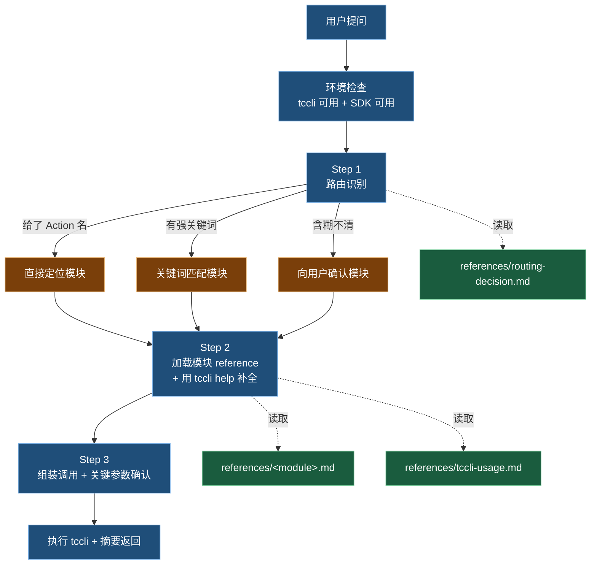

# 腾讯云可观测平台 — 原始 API 调用 Skill

本 skill 的核心职责是**路由 + 调用**：识别用户意图所属模块、加载对应模块指引、组装并执行腾讯云 API。

调用通道按"API 是否在 tccli CLI 白名单内"分两类：

| 通道 | 何时用 | 谁在用 |
|------|-------|-------|
| **tccli CLI** | 公开 SDK 已收录的标准 Action（GetMonitorData / DescribeAlarmPolicies / ...） | `monitor_query.execute_query`、用户直接 `tccli xxx yyy` 全部场景 |
| **Python SDK CommonClient** | 控制台内部 API（如 `mongodb:DescribeDBInstanceSummaries`），不在 CLI 白名单 | `instance_resolver.py` 全部子命令，绕过 CLI 校验直通后端网关 |

参考：[tccli 文档](https://cloud.tencent.com/document/product/440/34011)、[tencentcloud-sdk-python](https://github.com/TencentCloud/tencentcloud-sdk-python)。

---

## 决策路径总览



---

## 环境检查（每次首次调用前静默执行，仅失败时告知用户）

**Step 1 — 检查 tccli**

```bash
# Unix/macOS
which tccli && tccli --version
# Windows (PowerShell)
# Get-Command tccli; tccli --version
# Windows (cmd)
# where tccli && tccli --version
```

不存在则**告知用户缺失依赖**,推荐执行 `pip install tccli`(如需要管理员权限,由用户自行加 `sudo`);**LLM 不自动执行 `sudo`**。授权后再代为安装。安装失败则告知用户手动执行,不再继续。

**Step 2 — 检查 Python SDK**（`monitor-query` / `instance-resolver` 模块需要；纯告警查询可跳过此步）

> Windows 兼容：本 skill 文档与脚本统一用 `python3`；Windows 官方 Python 安装包默认只有 `python`（无 `python3` 别名），运行前请把命令中的 `python3` 替换为 `python`，或在 PowerShell 设置别名 `Set-Alias -Name python3 -Value python`。

```bash
python3 -c "from tencentcloud.common.common_client import CommonClient" 2>&1
```

不存在则**告知用户缺失依赖**,推荐执行 `pip3 install tencentcloud-sdk-python`,授权后再代为安装。`instance_resolver.py` 的 SDK 路径依赖此包。`alarm_lookup.py` 仅用标准库,不需要此 SDK。

**Step 3 — 就绪**

通过则**静默继续**，不输出噪声。失败时才告知具体故障。

> 凭证状态（未登录 / token 过期 / SecretId 无效）**不在环境检查阶段前置探测**。当后续真实调用 `tccli xxx` 失败且命中认证类错误时，再按 6.错误处理 与 [common/error_handling.md](references/common/error_handling.md) 的规则进入“静默刷新 → 交互登录”处理链路。

> 🔒 **安全红线**：禁止询问、接收、回显 SecretId / SecretKey 明文。OAuth 流可主动执行，用户给密钥明文则拒绝并引导 OAuth。

---

## 路由表（精简版，详细版见 [routing-decision.md](references/routing-decision.md)）

> 同名异义警告：**告警 API、Prometheus 实例管理、云产品监控查询都共用 tccli `monitor` 服务名**。区分靠"业务模块"，不是"tccli 服务名"。

| 用户意图关键信号 | 对应模块 | tccli 服务 | 加载 reference | 状态 |
|-----------------|---------|-----------|---------------|------|
| 拉云产品指标数据（CVM/CDB/CLB/COS… 的 CPU/内存/QPS/带宽） | 基础监控-查询 | `monitor` | `monitor-query/overview.md` | ✅ |
| 告警策略/告警历史(触发记录)/告警通知模板/可配置指标&事件元数据（**任何子业务**的告警都走这里） | 基础监控-告警 | `monitor` | `monitor-alarm.md` | ✅(只读;`Create*` / `Modify*` / `Delete*` / `Pause*` 等写操作引导控制台,见 monitor-alarm § 2 速查表备注 + § 7 常见踩坑)|
| APM、调用链、Trace、火焰图、应用性能、Span、业务系统(apm-) | APM | `apm` | `apm.md` | ✅ |
| 移动端崩溃、ANR、Android/iOS/鸿蒙/Flutter 客户端性能 | 终端性能监控 Pro | `rum` | `rum-app-pro.md` | ✅ |
| Web 性能、小程序性能、JS 错误、Ajax 错误、首屏测速 | 前端性能监控 | `rum` | `rum.md` | ✅ |
| 拨测、可用性探测、网络质量、CDN 质量、域名 whois | 云拨测 | `cat` | `cat.md` | ✅ |
| 压测、并发测试、JMeter、性能测试场景 | 云压测 | `pts` | `pts.md` | ✅ |
| Prometheus 实例、PromQL、Exporter、ServiceMonitor、TMP | Prometheus 监控 | `monitor`（Prometheus 子集） | `tmp.md` | ✅ |
| Grafana、托管 Grafana、可视化大盘 | Grafana 服务 | `grafana` | `grafana.md` | ✅ |
| Dashboard、智能仪表盘、监控面板（云产品监控 Dashboard） | Dashboard | `monitor` 子集（**走公共 API,内置脚本 `scripts/query_dashboard.py`**,tccli choice 未暴露） | `dashboard.md` | ✅ |
| 事件总线、EventBus、事件转投 | 事件总线 | `eb` | `eb.md` | ✅ |

\* `monitor` 服务名同时承载查询/告警/Prometheus/Dashboard 4 个子集，按 Action 名识别，不看服务名。
\* Dashboard 模块的查询 API（`DescribeUnifyDashboards` / `DescribeUnifyDashboard` / `DescribeDashboardMetricData`）**未在 tccli choice 中公开**,需走腾讯云公共 API 网关；本 skill 已内置 `scripts/query_dashboard.py` 封装 TC3-HMAC 签名与批次切片,详见 `dashboard.md`。

### 路由原则

1. **API Action 优先**：用户给了 `GetMonitorData` / `DescribeAlarmPolicies` 这类具体 Action，直接锁定模块，不再走关键词匹配
2. **关键词次优**：用上表关键词识别。无歧义直接路由，有歧义按"细分业务优先"——比如"我想看 APM 业务系统的告警"是**告警**模块，不是 APM 模块（因为告警 API 全在 monitor 下）
3. **含糊兜底**：用户只说"我要查腾讯云监控数据"，先用 AskUserQuestion 让用户在 2-4 个候选模块中选

---

## 通用调用规约

### 1. 加载顺序

确认模块后，按需读取（节省上下文）：

1. 必读：`references/<module>.md`（业务概念 + 推荐 Action + 常见坑）
2. 必读：`references/tccli-usage.md`（如果还没读过）
3. 用 tccli 自身能力补全 API 出入参：
   ```bash
   tccli <service> <action> help --detail
   ```
   `--detail` 会展开嵌套类型 + 中文说明，**不需要也不应该**预先把 API 文档全塞到 reference 里。

### 2. 参数组装

| 参数复杂度 | 推荐方式 |
|-----------|---------|
| 简单（标量参数 ≤ 5 个） | 命令行 `--Foo value --Bar value` |
| 含数组 / 嵌套对象 | **强烈推荐** `--cli-input-json file:///tmp/req.json` 走临时文件，避免 shell 转义 |
| 不熟悉的复杂结构 | 先 `tccli <svc> <action> --generate-cli-skeleton > /tmp/req.json` 拿模板，再编辑填值 |

### 3. 关键参数确认时机

下列参数按场景区分确认策略：

| 参数类型 | 策略 |
|---------|------|
| `--region` | **分场景**:① **列表类查询**(如 `DescribeAlarmPolicies` / `DescribeApmInstances`)**默认 `ap-guangzhou`**,在输出里**显式声明**"已默认查广州,如需其他地域请告知"——避免每次反问拖慢简单任务;② **实例特定查询**(如 `GetMonitorData ins-xxx` / `DescribeAlarmHistories --AlarmObject ins-xxx`)**必须**反问 region,因为错 region 直接返回空数据,用户根本不知道是 region 错还是数据真没有;③ 用户已用中文/缩写指代地域(广州/sh) → 按 [common/region_dict.md](references/common/region_dict.md) 映射,不再反问 |
| Namespace（云产品监控） | `QCE/CVM` vs `QCE/CDB` 决定查的是什么资源类型。错命名空间 → 全空。**坑**：`DescribeProductList` 返回的是小写形式（`qce/cvm`），但 `GetMonitorData` 入参必须**大写**（`QCE/CVM`）；`monitor_query.build_request` 已经做了 auto-uppercase 兜底，但手工调 tccli 时仍要注意 |
| `Instances` / 实例 ID | 写错查不到，且容易混 InstanceId / Uin / AppId |
| 时间窗口 (`StartTime`/`EndTime`) | 模糊"最近一段时间"必须明确：默认按"最近 1 小时"或"最近 1 天"，并在输出里写明 |
| 凭证 profile (`--profile`) | 多账号场景必须确认，默认走当前活跃 profile |

如果上下文工具中有 `current_time` / `time_to_unix` 这类时间工具，优先用工具计算时间参数，不要靠 LLM 自己推算。

### 4. 输出格式

| 场景 | 选项 |
|------|------|
| 默认结构化解析 | `--output json`（默认） |
| 表格化展示给用户 | `--output table` |
| 取部分字段 | `--filter <JMESPath>`，如 `--filter "Histories[*].Content"` |

### 5. 只读定位 — 写操作引导控制台

**本 skill 仅支持 `Describe*` / `Get*` 等只读 API**。识别到 `Create*` / `Modify*` / `Delete*` / `Put*` / `Pause*` / `Update*` / `Run*` / `Sync*` / `Terminate*` / `Bind*` / `Unbind*` / `Resume*` / `Enable*` / `Disable*` / `Install*` / `Uninstall*` / `Upgrade*` / `Clean*` / `Destroy*` / `Abort*` / `StartJob` / `PutEvents` 等写动作时:

1. **不构造**写 API 命令(即使用户明确要求"帮我创建/修改/删除")
2. **不调用** `tccli xxx Create*` / `tccli xxx Modify*` 之类的 help 探索写接口出入参
3. **直接告知**用户:"本 skill 仅支持只读 API,写操作请前往腾讯云控制台:<对应控制台 URL>"
4. 必要时可指出对应控制台路径(如告警策略 → `https://console.cloud.tencent.com/monitor/alarm2/policy`)

理由:写操作风险高(配置错误可能影响告警通知 / 启动压测击穿目标 / 删除资源等),需要 UI 上下文 + 多重校验,远超 CLI 命令展示+用户确认的能力。如果未来要支持写操作,需单独立项设计参数确认与回滚流程。

### 6. 错误处理

> 本表为**高频错误速查**。完整错误地图（含凭据过期/缺失、接口不存在、网络超时、限流退避策略等 9 类）见 [common/error_handling.md](references/common/error_handling.md)。两份冲突时以 common/error_handling.md 为准。

| HTTP 状态 / 错误码 | 行为 |
|-------------------|------|
| `403 / Unauthorized` / `AuthFailure.UnauthorizedOperation` | 先区分是权限不足还是认证状态异常；权限不足时提示用户当前账号缺少该产品/接口访问权限 |
| `AuthFailure.TokenFailure` / `AuthFailure.SecretIdNotFound` / 本地凭据缺失 | 按 [common/error_handling.md](references/common/error_handling.md) 的“认证修复链路”执行：静默刷新 1 次，失败后进入交互式登录 |
| `InvalidParameter` | 把 tccli 返回的错误 message 摘要给用户，附上你认为可能错的字段 |
| `ResourceNotFound` | 不要重试，提示用户检查 region / 资源 ID |
| `LimitExceeded` / 限频 | 退避重试 1 次，仍失败则报告 |
| `RequestTimeout` | 加 `--timeout 60` 重试 1 次 |

不要陷入死循环重试。失败 1-2 次后停下来跟用户对齐。

---

## references 索引

按**通用工具 → 通用模块 → 子产品模块**三层组织，按需加载。

### 通用工具（跨模块共享）

| 文件 | 用途 |
|------|------|
| [tccli-usage.md](references/tccli-usage.md) | tccli 通用用法（参数探索四法、调用模板、常用选项） |
| [routing-decision.md](references/routing-decision.md) | 详细路由决策（关键词、反例、AskUserQuestion 模板） |
| [common/region_dict.md](references/common/region_dict.md) | 地域中文/英文缩写 → ap-xxx ID 映射（全 18 个地域，覆盖国内+海外） |
| [common/error_handling.md](references/common/error_handling.md) | 跨子产品共享的错误码 → 友好提示映射 + tccli stderr 识别约定 + 重试禁忌 |

### 通用模块（被多个子产品主流程依赖）

| 文件 | 用途 |
|------|------|
| ⭐ [instance-resolver.md](references/instance-resolver.md) | **通用基础模块** — strategy_type 枢轴（产品识别 + 实例发现 + 维度生成），被 monitor-query 主流程依赖、未来给 monitor-alarm/tmp 复用 |
| ⭐ `references/data/*.jsonl` | **通用离线数据集**（跨 monitor-query / monitor-alarm 共用）<br>· `alarm_strategy.jsonl`（922 行,strategy_type 字典 == 旧 viewName,`instance_resolver` + `alarm_lookup` 共同消费）<br>· `api_metric_union.jsonl`（GetMonitorData 指标全集,`monitor_query` 消费）<br>· `show_product_dash.jsonl`（strategy_type → dashboard_config_id 映射） |

### 子产品模块（按路由表对应加载）

| 文件 | 用途 |
|------|------|
| ✅ [monitor-query/overview.md](references/monitor-query/overview.md) | 基础监控-查询：模块入口 + Action 索引 |
| ↳ [monitor-query/getmonitordata.md](references/monitor-query/getmonitordata.md) | GetMonitorData 完整工作流（6 步流水线） |
| ↳ ⭐ `references/data/*.jsonl` | **monitor-query 重度依赖**三份共享数据(详见上方"通用模块"段)。monitor-query 是 `alarm_strategy` / `api_metric_union` / `show_product_dash` 三份的主消费者 |
| ✅ [monitor-alarm.md](references/monitor-alarm.md) | **基础监控-告警**：所有子业务告警 API 入口（10 个只读 action：枚举/strategy_type/接口/陷阱/错误特化） |
| ↳ `scripts/alarm_lookup.py` | 封装 `data/alarm_strategy.jsonl` 查询（子命令：search / get / list_all），LLM 在用户提到非热门产品或多 strategy_type 产品时调用；与 instance_resolver 共用同一份元数据 |
| ✅ [apm.md](references/apm.md) | 应用性能监控 |
| ✅ [rum.md](references/rum.md) | 前端性能监控（Web/小程序） |
| ✅ [rum-app-pro.md](references/rum-app-pro.md) | 终端性能监控 Pro（Android/iOS/鸿蒙/Flutter） |
| ✅ [cat.md](references/cat.md) | 云拨测 |
| ✅ [pts.md](references/pts.md) | 云压测 |
| ✅ [tmp.md](references/tmp.md) | Prometheus 监控服务 |
| ✅ [grafana.md](references/grafana.md) | Grafana 服务 |
| ✅ [dashboard.md](references/dashboard.md) | Dashboard(云监控自带智能仪表盘);使用内置脚本 `scripts/query_dashboard.py` 调用公共 API |
| ✅ [eb.md](references/eb.md) | 事件总线(EventBridge);只读查询全量覆盖,纯 tccli 调用 |

---

## 反例提醒（容易踩的坑）

- ❌ 环境检查阶段就做凭证探测/登录 —— 会增加前置开销且与真实调用脱节；认证错误应在调用失败后按错误处理链路处置
- ❌ 看到"告警"就往 APM 模块里塞 —— 告警 API 都在 `monitor` 下，跟子产品无关
- ❌ 复杂结构参数硬靠 shell 转义 —— `'[{"Dimensions":[{"Name":"x"}]}]'` 这种容易翻车，走 `cli-input-json file://`
- ❌ 把所有 reference 一次全读 —— 浪费上下文，按路由结果**按需**加载（哪怕骨架模块也只在用到时读）
- ❌ 写操作展示命令并询问用户确认 —— 本 skill 是只读的,看到 `Create*` / `Modify*` / `Delete*` 等直接告知"不在范围,引导控制台"(见 § 5),不要构造写命令
- ❌ 凭空猜 Namespace —— `QCE/CVM` 还是 `QCE/CDB` 必须按用户的资源类型来；不确定用 `tccli monitor DescribeProductList --Module monitor` 探查（注意：返回小写 `qce/xxx`，但 `GetMonitorData` 入参必须大写 `QCE/XXX`）
- ❌ 在 reference / 示例里建议用 `jq` —— 本 skill 环境检查不强制 `jq`，统一用 tccli 的 `--filter`（JMESPath）+ `python3 -c "import json,sys;..."` 完成二次解析；只有 Python ≥ 3.7 是硬依赖
