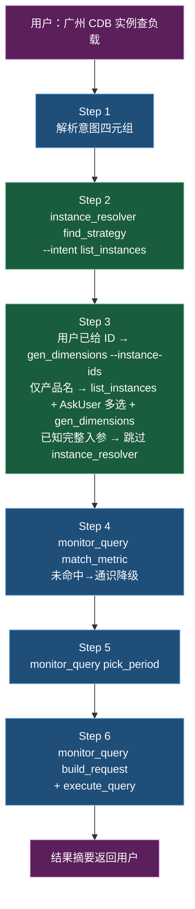

# GetMonitorData 完整工作流

> Action: `tccli monitor GetMonitorData`
> 用途: 拉取云产品监控的时序指标数据
> 配套脚本: [`scripts/monitor_query.py`](../../scripts/monitor_query.py) + [`scripts/instance_resolver.py`](../../scripts/instance_resolver.py)
> 配套数据: `data/{alarm_strategy,show_product_dash,api_metric_union}.jsonl`

GetMonitorData 的复杂度全集中在"组装入参"。本文档把它拆成 6 步流水线，机械计算外包给两个脚本，LLM 只负责意图理解、按 `next_action` 反问、最终命令执行。

> **Step 5 维度 keys 现场问用户**这一步已被移除——`instance_resolver.gen_dimensions` 通过 DescribeAllNamespaces 实时拿到，不再需要。

## 目录

- § 1 入参四元组 — 必填/可选 + 用户模糊提问时如何补全
- § 2 6 步流水线总览(mermaid + 串联)
- § 3 逐步指引(Step 1~6 + 模式 A/B/直通车)
- § 4 模型决策守则(next_action 字段语义汇总)
- § 5 错误处理速查
- § 6 关键约束与坑点(汇总)
- § 7 完整端到端示例(MongoDB / CDB)

---

## 1. 入参四元组

| 入参 | 类型 | 用户模糊提问时常见状态 | 解决路径 |
|------|------|---------------------|---------|
| `Namespace` | Required | 通常已知 | Step 2 推导 |
| `MetricName` | Required | 常未知 | Step 4 模糊匹配 |
| `Instances` | Required | 常未知 | Step 3 实例发现 |
| `Period` | Optional | 智能推算 | Step 5 |
| `StartTime`/`EndTime` | Optional | 用户语境推断 | Step 1 |
| `--region` | CLI flag | 用户指定或问 | Step 1 |

---

## 2. 6 步流水线总览



---

## 3. 逐步指引

### Step 1：解析用户输入

| 抽取项 | 示例 | 处理 |
|-------|------|------|
| 产品名 | "CDB" / "云数据库" | → Step 2 |
| 指标描述 | "负载" / "CPU 利用率" | → Step 4 |
| 实例 ID | `cdb-abc123` | → Step 3 走**简化路径** §3.B(`gen_dimensions --instance-ids`),跳过 `list_instances` 但**仍需** `gen_dimensions` 拿到 Dimensions(直接进 Step 5 会缺 `Instances[].Dimensions`) |
| 时间范围 | "最近 1 小时" | 转 ISO8601（**必须带时区** `+08:00`） |
| 地域 | "广州" | 映射为 `ap-guangzhou` |

**地域速查**（更全见 instance_resolver 的 `available_regions_long` 输出）：

| 中文 | tccli region |
|------|--------------|
| 广州 | `ap-guangzhou` |
| 上海 | `ap-shanghai` |
| 北京 | `ap-beijing` |
| 香港 | `ap-hongkong` |

---

### Step 2：产品 → strategy_type

```bash
python3 scripts/instance_resolver.py find_strategy "CDB" --intent list_instances --limit 6
```

**注意 `--intent` 参数**：
- 流程最终目的是 GetMonitorData → 用 `list_instances` 意图
- L2 多候选同 root_api 时**自动免反问**（实例都一样）
- 模型按 `next_action` 字段决定下一步

**输出关键字段**：

```json
{
  "candidates": [...],
  "next_action": "auto_continue",
  "reason": "L2: 6 candidates with same root_api=cdb:DescribeDBInstances, ..."
}
```

| `next_action` | 行为 |
|--------------|------|
| `auto_continue` | 用 candidates[0]（最高分）继续 |
| `ask_user_l2` / `ask_user_l3` | AskUserQuestion 让用户选 |

---

### Step 3：实例发现 + 维度生成

按用户已知信息量分支：

| 用户给的信息 | 推荐路径 | 说明 |
|------------|---------|------|
| 仅产品名（"MongoDB"） | 3.A 完整流程 | list_instances 反问选实例 → gen_dimensions |
| 实例 ID（如 `cmgo-9l5bmguf`） | **3.B 简化路径** | 直接 `gen_dimensions --instance-ids` 一步搞定（推荐） |
| 完整 (namespace + metric + dimension name + value) | **跳过 instance_resolver** | 直接 Step 6 build_request 直通车（见 §6.0） |

#### 3.A 完整流程（用户没给 instance ID）

```bash
python3 scripts/instance_resolver.py list_instances cdb_detail --region ap-guangzhou --limit 50
```

输出 `instance_count` + `instances[]` 数组（含 `raw` 原始字段 + `mapped` 字段映射 + `depth` 父链深度）。

`next_action` 通常是 `ask_user_select_instances` —— 用 AskUserQuestion 让用户多选。**单请求 ≤ 50 实例**。

用户选实例后：

```bash
python3 scripts/instance_resolver.py gen_dimensions cdb_detail \
    --region ap-guangzhou \
    --instances '[<选中的实例的完整对象，含 raw + mapped>]'
```

#### 3.B 简化路径（用户已给 instance ID）⭐ 推荐

```bash
python3 scripts/instance_resolver.py gen_dimensions cmongo_instance \
    --region ap-guangzhou \
    --instance-ids cmgo-9l5bmguf
```

**为什么不用 `--instances` 手工构造 mapped**：每个产品的 alarm key 名都不同（CDB=`uInstanceId`、CVM=`unInstanceId`、MongoDB=`cluster`、Redis Proxy 是 `appid+pnodeid+instanceid` 三件套）。LLM 不应预先知道这些命名约定。`--instance-ids` 让脚本从 Config 自动推断 lookup keys 并合成 mapped，**单维度产品一步命中 primary**。

**多维度产品例外**：脚本输出 `[multi_dim_warn]` 时（如 Redis Proxy），单 ID 不够，回退到 3.A 路径走 list_instances。

#### 通用输出结构

```json
{
  "scenes": {
    "api_query": {
      "instances": [{
        "primary": {
          "rank": 1, "source": "alarm2dashboardMapping",
          "Dimensions": [{"Name": "target", "Value": "cmgo-9l5bmguf"}],
          "name_keys": ["target"]
        },
        "candidates": [...]
      }]
    }
  }
}
```

> 关键：API 维度的 `Name` 字段在不同产品有不同元数据来源（CDB 走 `eventDimensions.keys`，MongoDB 走 `alarm2dashboardMapping`，CVM 走 PascalCase 启发式）。`primary` 是按可信度排序后的首选；如果 GetMonitorData 报 `InvalidParameterValue : unauthorized operation` 类错误，按 `candidates[1+]` 顺序换 dimension 重试。

#### 候选空时的恢复指引

如果输出 `next_action: no_candidates_use_instance_ids_or_list_instances`，按 warnings 指引：

| 警告 | 含义 | 修复 |
|------|------|------|
| `[multi_dim_warn]` | 多维度产品用 `--instance-ids` 不够 | 改 list_instances + `--instances` 完整 mapped |
| `[no_api_candidates]` (--instances 模式) | 手工 mapped 的 key 名错了 | 改 `--instance-ids` 简化模式或 list_instances |
| `[no_api_candidates]` (--instance-ids 模式) | Config 元数据全空（极少见） | 检查 `config_dim_fields` 字段，可能产品配置异常 |

---

### Step 4：模糊匹配指标

```bash
python3 scripts/monitor_query.py match_metric cdb_detail "负载" --limit 5
```

**匹配字段权重**：`api_metric_name_zh`(12) > `api_metric_name`(10) > `meaning_zh`(8) > `meaning_en`(4)。

**两层 scope**（默认 `--scope both`）：

1. **primary**：`strategy_type` 对应 `dash_id` 主集（如 `cdb_detail` → `dash=cdb` 的 125 条 CDB 主机指标）
2. **extended**：同 `api_namespace` 下其他 `dash_id` 的扩展集（如 `cdb_cluster` / `cdb_proxy` / `cdb_libradb_*`）

`match_metric` 先在 primary 上找；primary 0 命中时回退到 extended，输出会带 `matched_source=extended` + `note`，提醒模型用户可能想要别的子产品（必要时回 instance_resolver 重选 strategy_type）。

`--external-only` 显式只匹配 `is_external=1` 的对外指标；默认包含全部，避免漏掉 `AliveStatus`（存活状态）这类 is_external=0 但能查的指标。

**输出的 `next_action`**：

| `next_action` | 含义 | 模型行为 |
|--------------|------|---------|
| `auto_continue` | 唯一命中 | 直接用 |
| `ask_user_choose_metric` | 多候选 | AskUserQuestion 让用户选 |
| `model_select_by_semantics` | 0 命中（如"负载"） | **模型按通识从 `all_metrics` 挑 3-5 个**，再 AskUserQuestion 让用户确认。`all_metrics` 是 namespace 全集（primary + extended） |

**通识降级清单（参考）**：

| 用户语义 | 通识候选指标（CDB 例） |
|---------|---------------------|
| "负载" | CpuUseRate / MemoryUseRate / IopsUseRate / ConnectionUseRate |
| "性能" | 同上 + Qps / Tps |
| "压力" | CpuUseRate / IopsUseRate / SlowQueries |
| "健康度" | RplSemiSyncMasterEnabled / SecondsBehindMaster + 利用率类 |
| "存储" | VolumeRate / Capacity / DiskRemaining |

**重要：单指标限制**。GetMonitorData 一次只能查 1 个 MetricName。"看负载"等场景需要**展开为 N 次调用**（每个指标一次 build_request + execute_query），最后聚合摘要。

---

### Step 5：Period + StatType 推算

```bash
python3 scripts/monitor_query.py pick_period \
    --duration 3600 \
    --instance-count 5 \
    --stat-types '{"5":"max","60":"max","300":"max","86400":"max"}'
```

`--stat-types` 取自 Step 4 选定 metric 的 `seconds_stat_type` 字段。

**默认偏好**：选数据点落在 `[30, 200]` 区间的 Period（"舒适粒度"）。1 小时窗口 + 1 实例选 60s（61 点）而不是 5s（721 点）。

如需指定：`--preferred 60`。

**约束**：单请求数据点 ≤ 7200，超限自动报错（要求拆批）。

---

### Step 6：组装请求 + 执行 + 摘要

#### 6.0 直通车（已知完整入参时跳过 instance_resolver）

如果调用方/上下文**已经知道** `(namespace, metric, dimension name, instance value)` 四元组（比如缓存了之前查过的产品、用户明确指定了维度名、或人在调试），可以**完全跳过** instance_resolver，直接 build_request：

```bash
python3 scripts/monitor_query.py build_request \
    --namespace QCE/CMONGO --metric Counts \
    --dimension-keys target \
    --instances '[{"target":"cmgo-9l5bmguf"}]' \
    --period 60 --start-time "..." --end-time "..."
```

> 不知道维度名时不要走这条路径——猜错就是 `InvalidParameterValue : unauthorized operation`。回到 Step 3 走 `--instance-ids` 或 list_instances 让脚本告诉你正确的维度名。

#### 6.1 生成请求文件（推荐 `--from-candidate` 模式）

直接喂 Step 3 拿到的 `scenes.api_query.instances[i].primary`：

```bash
python3 scripts/monitor_query.py build_request \
    --namespace QCE/CDB \
    --metric CpuUseRate \
    --from-candidate '{"rank":2,"source":"eventDimensions(dict).keys","Dimensions":[{"Name":"InstanceId","Value":"cdb-pu9e675b"}],"name_keys":["InstanceId"]}' \
    --period 60 \
    --start-time "2026-06-08T00:00:00+08:00" \
    --end-time "2026-06-08T01:00:00+08:00"
```

> `--from-candidate` 是 Step 3 流程的下游接口；`--dimension-keys + --instances` 的传统模式（同 §6.0）也能用，但需要调用方自己已知维度名。

⚠️ **`--from-candidate` 当前只支持单实例**(`monitor_query.py` 内部 `instances_out = [{"Dimensions":...}]`,见 scripts/monitor_query.py:490)。**用户多选 N 台实例时**,模型必须**循环 N 次** build_request + execute_query,每次喂 `scenes.api_query.instances[i].primary`,合并 N 份输出:

> 🚨 **参数对称坑（高频踩坑）**：`build_request` 用 **`--out`**（输出路径），`execute_query` 用 **`--request-file`**（输入路径）——参数名**不对称**。把两者写反会触发 `argparse: unrecognized arguments`。**伪代码中已对齐使用，请勿改回 `build_request --request-file`**。

```bash
# 伪代码:多实例循环（路径示意 Unix；Windows 用 %TEMP%\req_$i.json 或省略 --out 让脚本走 tempfile.gettempdir）
for i in 0..N-1:
    primary_i = scenes.api_query.instances[i].primary
    build_request --from-candidate "$primary_i" --out /tmp/req_$i.json ...     # ← --out（输出）
    execute_query --request-file /tmp/req_$i.json ...                           # ← --request-file（输入）
# 合并 N 份输出后展示给用户
```

如果未来需要单次 build_request 处理多实例,要在 `monitor_query.py` 加 `--from-candidates-json`(数组版本);目前**没有**这个能力。

#### 6.2 执行 + 摘要

```bash
python3 scripts/monitor_query.py execute_query \
    --request-file /tmp/getmonitordata_xxx.json \
    --region ap-guangzhou
# Windows: --request-file %TEMP%\getmonitordata_xxx.json
```

**自动兼容两种 tccli 响应结构**（带 `Response` 外层 vs 裸响应）。

#### 6.3 维度失败时的候选 fallback

执行失败时按错误码决策：

| tccli 错误信息 | 含义 | 行动 |
|--------------|------|------|
| `InvalidParameterValue : unauthorized operation or the instance has been destroyed` | **维度名错（高频）** 或实例不存在 | **优先**按 `candidates[next_rank]` 重试 build_request + execute_query |
| `InvalidParameterValue : metricName or viewName not match` | 指标名+namespace 不匹配（jsonl drift） | 不再重试维度，提示用户该指标可能已下线 |
| `UnauthorizedOperation` / `AuthFailure.*` | 账号无权限 | 不重试，告知用户 |

**fallback 实操**：模型从 `scenes.api_query.instances[0].candidates` 数组按 rank 升序取下一个，重新走 build_request + execute_query；最多试到 candidates 末尾，仍失败则报告"所有候选维度名都试过，可能是实例 ID 错"。

**输出**（每实例一行）：

```json
{
  "metric": "CpuUseRate",
  "period": 60,
  "instance_count": 1,
  "summaries": [
    {"dimensions": "InstanceId=cdb-pu9e675b", "n": 61, "min": 0.46, "avg": 0.49, "max": 0.56, "last": 0.51}
  ]
}
```

#### 6.4 多指标场景

"看负载"展开成 N 次后，模型聚合多个 execute_query 的 summaries 给用户看：

| 指标 | min | avg | max | last |
|------|-----|-----|-----|------|
| CpuUseRate | 0.46% | 0.49% | 0.56% | 0.51% |
| MemoryUseRate | 5.79% | 5.88% | 5.95% | 5.88% |
| IopsUseRate | 0.11% | 0.11% | 0.14% | 0.11% |

---

## 4. 模型决策守则（汇总）

每一步都按脚本输出的 `next_action` 字段决策，不要自行判断。

### `next_action` 速查

| 值 | 含义 | 模型行为 |
|----|------|---------|
| `auto_continue` | 单一确定性结果 | 直接进下一步 |
| `ask_user_l2` / `ask_user_l3` | strategy_type 多候选 | AskUserQuestion 让用户在 candidates 中选 |
| `ask_user_select_instances` | 实例多于 1 | AskUserQuestion 让用户多选 |
| `ask_user_choose_metric` | 指标多候选 | AskUserQuestion 让用户选；若结果含 `matched_source=extended`，提醒用户主集 0 命中、当前匹配来自其他 dash_id（可能想要别的子产品） |
| `model_select_by_semantics` | 指标 0 命中 | 按通识从 `all_metrics`（namespace 全集）挑 3-5 个，AskUserQuestion 确认 |

### 反问的话术原则

- 给候选时附上**业务说明**（不只是 strategy_type 名字，加 `console_menu_zh`）
- 多个候选同分时**默认推荐第一个**并加"（推荐）"标记
- 用户答 "Other" 自然走自由表达分支

---

## 5. 错误处理速查

| 现象 | 排查方向 |
|------|---------|
| `InvalidParameter.Region` | 切 region；查 `available_regions_long` |
| `UnauthorizedOperation` / `AuthFailure` | 当前账号无权限；不假装查到了 |
| 全空 `Values: []` 但 200 OK | 实例不存在 / 维度值错 / region 错 / 香港数据在广州 set 上报 |
| `instance_resolver` 输出 `next_action=error_stop` | 实例发现 SDK 调用失败(版本/凭证/网络),按 reason 字段告知用户停下;不要继续构造 GetMonitorData 请求 |
| `RequestLimitExceeded` | 退避 1 次；仍失败告知用户后停下 |

---

## 6. 关键约束与坑点（汇总）

| 约束 | 触发场景 | 处理 |
|------|---------|------|
| 数据点 ≤ 7200 | 时间×实例÷Period 超限 | `pick_period` 自动过滤 |
| 实例 ≤ 50 / 请求 | 用户给 60 个实例 | `build_request` 拒绝；模型拆批调 |
| Namespace 大小写 | DescribeProductList 返小写、GetMonitorData 入参大写 | `build_request` 自动 upper |
| 时区必填 | `2024-01-01T10:00:00`（无时区）会被错认 UTC | `build_request` 校验 ISO8601 含时区 |
| MetricName 大小写敏感 | `CPUUsage` ≠ `CpuUsage` | 用户选定的 metric 直接传 |
| 单请求 1 指标 | "看一组指标" | 拆 N 次调用 |
| InstanceType 等扩展维度 | CDB 文档例子带 InstanceType=2 | 实测：只传 InstanceId 也成功；按 gen_dimensions 输出走即可 |

---

## 7. 完整端到端示例

### 示例 A：仅产品名（走 3.A 完整流程）

**用户输入**：

> 帮我看一下广州区任意一台 CDB 实例最近 1 小时的负载

**LLM 行为流水**：

1. **Step 1** 抽取：region=广州→ap-guangzhou / duration=1h / product=CDB / metric=负载 / instance=任意一台
2. **Step 2** `instance_resolver find_strategy "CDB" --intent list_instances` → `next_action: auto_continue`（L2 同 root_api）→ 选 `cdb_detail`
3. **Step 3.A** `list_instances cdb_detail --region ap-guangzhou --limit 50` → 7 台实例 → `next_action: ask_user_select_instances` → 用户说"任意一台" → 取第 1 台 `cdb-pu9e675b`；`gen_dimensions --instances '[<选中实例完整对象>]'` → `scenes.api_query.instances[0].primary = {Dimensions:[{Name:"InstanceId", Value:"cdb-pu9e675b"}]}`
4. **Step 4** `match_metric cdb_detail "负载"` → `next_action: model_select_by_semantics` → 模型按通识挑 `CpuUseRate / MemoryUseRate / IopsUseRate` → AskUserQuestion → 用户答"按通识来" → 用 3 个指标
5. **Step 5** `pick_period --duration 3600 --instance-count 1 --stat-types ...` → 60s（61 点，舒适）
6. **Step 6** ×3：每个指标 build_request + execute_query → 聚合 3 个 summaries
7. 最终摘要：

   > cdb-pu9e675b 最近 1 小时几乎闲置：CPU 0.49%（max 0.56%），内存 5.88%，IOPS 0.11%。

**总反问次数：1**（仅在 Step 4 通识降级时确认指标），**总脚本调用次数：~10**。

### 示例 B：用户已给 instance ID（走 3.B `--instance-ids` 简化路径）⭐

**用户输入**：

> 查询 MongoDB 实例 cmgo-9l5bmguf（广州地域）的 count请求次数、聚合请求次数、磁盘使用率、连接使用率

**LLM 行为流水**：

1. **Step 1** 抽取：region=ap-guangzhou / instance=cmgo-9l5bmguf / 由 `cmgo-` 前缀推 product=MongoDB / 5 个具体指标
2. **Step 2** `find_strategy "MongoDB" --intent gen_dimensions` → 多候选反问选 `cmongo_instance`（实例视角，非云盘版/集群版/Mongos 节点）
3. **Step 3.B** `gen_dimensions cmongo_instance --region ap-guangzhou --instance-ids cmgo-9l5bmguf` →
   `primary = {rank:1, source:"alarm2dashboardMapping", Dimensions:[{Name:"target", Value:"cmgo-9l5bmguf"}]}`（一步命中，无需 list_instances）
4. **Step 4** ×4: `match_metric cmongo_instance "count请求次数"` → 命中 `Counts`；其他几个走通识降级或 namespace 全集匹配
5. **Step 5** `pick_period --duration 3600 --instance-count 1 ...` → 60s
6. **Step 6** ×4: `build_request --from-candidate <primary>` + execute_query → 聚合
7. 最终摘要：

   > cmgo-9l5bmguf 最近 1 小时：count请求 67/min，聚合请求 0，磁盘 3%，连接 3.1%。

**关键差异**：示例 B 跳过了 `list_instances` + 用户多选反问，**用 `--instance-ids` 简化模式一步拿到正确的 API 维度名 `target`**——LLM 完全不需要预先知道 MongoDB 的维度名约定。

**总反问次数：0~1**（Step 2 反问选 strategy_type 子型；Step 4 视指标命中情况可能 0 反问）。
