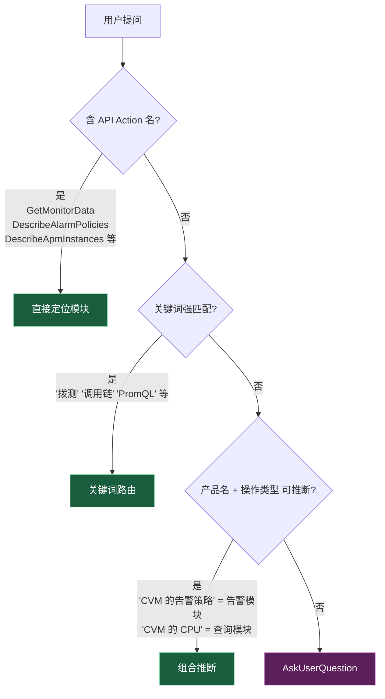

# 路由决策表（详细版）

> SKILL.md 已经有简版路由表。本文件给"边界场景 / 反例 / AskUserQuestion 模板"。模糊场景拿不准时再读这份。

## 1. 路由心智模型



## 2. API Action → 模块 直接映射

按 Action 名前缀 / 关键字识别：

| Action 命中 | 模块 | 备注 |
|------------|------|------|
| `*MonitorData` / `*BaseMetrics` / `*ProductList` / `*MonitorTypes` | 基础监控-查询 | 拉云产品指标 |
| `*AlarmPolic*` / `*AlarmHistor*` / `*AlarmNotice*` / `*AlarmRule*` / `*AlarmEvent*` | 基础监控-告警 | 告警全部走这里 |
| `*Apm*` | APM | apm 服务下 |
| `*RumProject*` / `*RumSession*` / `*RumLog*`（Web/小程序场景） | 前端性能监控 | rum 服务下，Web/小程序部分 |
| `*FOOM*` / `*LagANR*` / `*ApplicationExit*` / `*AppMetrics*` / `*AppSingleCase*` / `*AppDimension*` | 终端性能监控 Pro | rum 服务下移动端专属;`*Issues*` / `*Exception*` / `*Error*` 类与 rum.md(Web 端)共用,看用户上下文区分 |
| `*Cat*` | 云拨测 | cat 服务下 |
| `*PtsScenario*` / `*PtsJob*` / `*PtsAgent*` | 云压测 | pts 服务下 |
| `*PrometheusInstance*` / `*PrometheusAgent*` / `*PrometheusConfig*` | Prometheus 监控 | monitor 服务下 |
| `*GrafanaInstance*` / `*GrafanaPlugin*` / `*GrafanaWhiteList*` | Grafana 服务 | grafana 服务下 |
| `*UnifyDashboard*` / `*DashboardMetricData*` | Dashboard | monitor 服务下 |
| `*EventBus*` / `*Connection*` / `*Target*` / `*Rule*` / `*Transformation*` / `*PlatformEvent*` / `SearchLog` | 事件总线 | eb 服务下 |

> 上面的 Action 命中模式是常见前缀，**不是穷举**。SDK 总计 400+ 个 Action（只读 ~200），routing 表只收"前缀强信号"，按需查询走两条路：
>
> 1. **完整只读 Action 列表**：去对应模块的 reference 文件查（[apm.md](apm.md) / [rum.md](rum.md) / [rum-app-pro.md](rum-app-pro.md) / [cat.md](cat.md) / [pts.md](pts.md) / [tmp.md](tmp.md) / [grafana.md](grafana.md) / [eb.md](eb.md) / [monitor-alarm.md](monitor-alarm.md) / [monitor-query/overview.md](monitor-query/overview.md) / [dashboard.md](dashboard.md)）
> 2. **入参/出参细节**：用 `tccli <service> <action> help --detail`，不要预先把 SDK 文档塞进 reference
>
> ⚠️ **前缀失效时怎么办**：少数 Action 名不带产品标识（如 `SearchLog`、`DescribeAccidentEventList`、`DescribeMetricRecords`），无法用前缀路由。此时按"用户业务关键词"走 §3，或直接读对应模块 reference 确认归属——**不要硬猜服务名**。

## 3. 关键词 → 模块 映射（含反例）

### 3.1 基础监控-查询

✅ 强信号：
- "查 CVM 的 CPU 使用率" / "看 CDB 的连接数" / "拉 CLB 的带宽"
- "云监控指标" / "Barad 数据" / "GetMonitorData"
- 产品名 + 性能指标（"CDN 的命中率"、"COS 的请求数"）

❌ 反例：
- "**APM 的吞吐量**" → **APM 模块**，不是基础监控（APM 自己有性能数据通道）
- "**Prometheus 实例的状态**" → **TMP 模块**（实例管理）
- "**Prometheus 的查询数据**" → 用 PromQL 走 TMP 模块（不是 GetMonitorData）

### 3.2 基础监控-告警（横切，最容易踩坑）

✅ 强信号——**任何子业务的告警都走这里**：
- "看 CVM 告警策略" / "我有哪些 APM 告警" / "拨测告警没收到"
- "创建告警" / "修改告警通知" / "告警事件历史"
- 涉及"告警/alert/alarm/alerting/告警通知/告警接收"且不带"具体性能数据"

❌ 反例：
- "**APM 慢请求列表**" → APM 模块（虽然慢请求也算异常，但不是告警 API）
- "**前端 JS 错误率**" → rum 模块（性能数据，不是告警事件）
- "**Prometheus AlertManager 规则**" → TMP 模块（Prometheus 自己的告警机制）⚠️ 但**云监控告警策略**仍走基础监控-告警

> 判断要点：用户问的是"**配置告警的逻辑**（策略、阈值、通知人）"还是"**性能数据本身**（指标值、错误数）"？前者→告警模块，后者→对应子业务模块。

> ⚠️ **写动作豁免(本 skill 只读)**:强信号里出现"**创建告警 / 修改告警通知 / 删除策略 / 暂停策略**"等 `Create*` / `Modify*` / `Delete*` / `Pause*` 时,识别为本模块后**按 [SKILL.md §5](../SKILL.md) 直接引导用户去腾讯云控制台**(`https://console.cloud.tencent.com/monitor/alarm2/policy`),**不要**构造命令、不要 `tccli help` 探索写接口入参。模板 B(§4)默认也只在只读查询场景下使用。

### 3.3 APM

✅ 强信号：
- "APM" / "应用性能监控" / "调用链" / "Trace" / "Span" / "火焰图"
- 业务系统 ID 以 `apm-` 开头（如 `apm-lX3OgKtRC`）
- "服务拓扑" / "接口分析" / "慢 SQL 分析"

❌ 反例：
- "APM 的告警" → 基础监控-告警（**告警优先**）
- "前端的性能瓶颈" → rum 模块（前端是 RUM，不是 APM）

### 3.4 终端性能监控 Pro（rum-app-pro）

✅ 强信号：
- "Android 崩溃" / "iOS ANR" / "鸿蒙性能" / "Flutter 卡顿"
- "客户端应用质量" / "移动 APP 性能" / "Native 崩溃"
- "符号表" / "应用版本崩溃率对比"

❌ 反例：
- "Web 页面卡顿" → rum
- "微信小程序性能" → rum

### 3.5 前端性能监控（rum）

✅ 强信号：
- "Web 性能" / "前端" / "首屏测速" / "JS 错误" / "Ajax 错误" / "白屏"
- "微信小程序 / QQ 小程序 / Hippy / Weex / React Native / Cocos"（虽然 RN 也算客户端，但 RUM 体系下归前端）
- "页面加载时间" / "资源测速"

❌ 反例：
- "iOS App 启动慢" → rum-app-pro（原生应用走 Pro）
- "前端的告警" → 基础监控-告警

### 3.6 云拨测（cat）

✅ 强信号：
- "拨测" / "可用性探测" / "全球节点" / "CDN 评估" / "防劫持"
- "网络质量监测" / "页面性能模拟" / "端口探测" / "域名 whois"
- "PC 拨测点 / 手机拨测网络"

❌ 反例：
- "我自己的网站监控" → 看具体诉求:要拨测节点视角的探活 → cat;要浏览器/小程序侧真实用户体验 → rum(Web/小程序);要原生 App 侧用户体验 → rum-app-pro(Android/iOS/鸿蒙/Flutter)

### 3.7 云压测（pts）

✅ 强信号：
- "压测" / "性能测试" / "并发测试" / "JMeter"
- "百万并发" / "全链路压测" / "压测场景"

> ⚠️ **PTS 写动作密集 — 几乎全场景都要走控制台**:云压测 Action 大部分是写动作(`CreateScenario` / `StartJob` / `AbortJob` / `CopyJob` / `ModifyScenario` 等),只有 `DescribeScenarios` / `DescribeJobs` 等少量只读。识别到"创建压测场景 / 启动压测 / 中止 Job / 调试任务"等写诉求时,按 [SKILL.md §5](../SKILL.md) **直接引导用户去腾讯云控制台**(`https://console.cloud.tencent.com/pts`),**不要**构造启动命令——压测启动会真实击穿目标,风险极高,绝不能由 LLM 通过 CLI 触发。

### 3.8 Prometheus 监控（tmp）

✅ 强信号：
- "Prometheus 实例" / "PromQL" / "Exporter" / "ServiceMonitor" / "PodMonitor"
- "TMP" / "容器监控" / "K8s 监控" / "TKE 监控"
- "时间序列" / "Series" / "Recording Rule"

❌ 反例：
- "Prometheus 实例的告警通知人" → 配置告警通知归基础监控-告警；规则本身归 tmp

### 3.9 Grafana 服务（grafana）

✅ 强信号：
- "Grafana" / "TCMG" / "托管 Grafana" / "Grafana 数据源"
- "可视化大盘" 且明确提到 Grafana

❌ 反例：
- "云产品的仪表盘" → Dashboard 模块（云监控自带仪表盘，不是 Grafana）

### 3.10 Dashboard

✅ 强信号：
- "云产品监控仪表盘" / "Dashboard" / "智能仪表盘"

⚠️ 边界：
- 用户说"Dashboard"含糊时要确认：是云监控自带的 Dashboard，还是 Grafana 大盘？
- 云监控 Dashboard 的 3 个查询 Action（`DescribeUnifyDashboards` / `DescribeUnifyDashboard` / `DescribeDashboardMetricData`）**未在 tccli choice 中暴露**,调用走公共 API 网关；本 skill 内置 `scripts/query_dashboard.py` 封装 TC3-HMAC 签名,详见 [dashboard.md](dashboard.md)。
- 看到 `tccli monitor help --detail | grep -i dashboard` 只返回 `Uninstall/UpgradeGrafanaDashboard` 时不要误以为没有查询接口——那两条是 Grafana 域写动作，与本模块无关。

### 3.11 事件总线（eb）

✅ 强信号：
- "事件总线" / "EventBridge" / "EventBus" / "事件转投" / "事件规则" / "事件目标" / "事件连接器" / "事件转换器"
- 事件流转日志检索（`SearchLog`）、平台产品事件模板查询

---

## 4. AskUserQuestion 模板（含糊场景兜底）

### 模板 A：用户笼统问"监控"

```
question: "你说的监控，是想做什么？"
options:
  - label: "查云产品（CVM/CDB/...）的指标数据"     → monitor-query
  - label: "管理告警策略/查告警事件"                → monitor-alarm
  - label: "应用性能（APM）/ 前端 / 移动端"          → 进入二次选择
  - label: "Prometheus / Grafana 自建监控"          → tmp / grafana
```

### 模板 B：用户说"告警"但不指定子业务

通常不需要二次问——告警 API 都在基础监控-告警下。

⚠️ **写动作直接走控制台,不进 AskUserQuestion**:如果用户的诉求是"创建/修改/删除/暂停告警策略 / 修改通知模板"等写动作,按 [SKILL.md §5](../SKILL.md) **直接引导用户去腾讯云控制台**(`https://console.cloud.tencent.com/monitor/alarm2/policy`),**不要**用 AskUserQuestion 收敛监控类型——本 skill 是只读定位,即使收敛了也不会构造写命令,多走一轮反问反而拖慢用户。

只有在**只读查询**且产品范围模糊跨多 MonitorType(如用户笼统说"我账号下的告警都触发了什么")时,才用 AskUserQuestion 缩小过滤范围,再调 `DescribeAlarmPolicies` / `DescribeAlarmHistories`:

```
question: "你想查哪类告警的策略/历史?"
options:
  - label: "云产品指标(CVM/CDB/CLB 等)"     → MonitorType=MT_QCE
  - label: "APM 应用性能"                   → MonitorType=MT_TAW
  - label: "前端 / 移动端 RUM"              → MonitorType=MT_RUM / MT_RUMAPP
  - label: "Prometheus 自定义指标"          → 见 tmp.md
```

### 模板 C：用户说"前端" / "客户端" 含糊

```
question: "你的应用平台是？"
options:
  - label: "Web / H5 / 微信小程序"           → rum
  - label: "Android / iOS / 鸿蒙 / Flutter 原生应用"   → rum-app-pro
  - label: "React Native / Hippy / Weex 跨端"  → rum
```

### 模板 D：用户说"Dashboard / 大盘 / 仪表盘"

```
question: "你想用哪种可视化？"
options:
  - label: "腾讯云监控自带的 Dashboard"        → dashboard
  - label: "托管 Grafana"                      → grafana
  - label: "Prometheus + Grafana 组合方案"      → tmp + grafana
```

---

## 5. 模型自检清单（路由完成前过一遍）

- [ ] 我把"告警"和"监控数据查询"区分开了吗？告警都在 monitor-alarm
- [ ] 用户提到的产品名（CVM/CDB/Redis…）是云产品监控范畴吗？是的话进 monitor-query
- [ ] 前端 vs 移动端有没有混？Web/小程序 = rum，原生 = rum-app-pro
- [ ] 用户给的 Action 名前缀对应什么模块？前缀优先级最高
- [ ] 含糊时我用 AskUserQuestion 收敛了吗？不要硬猜
