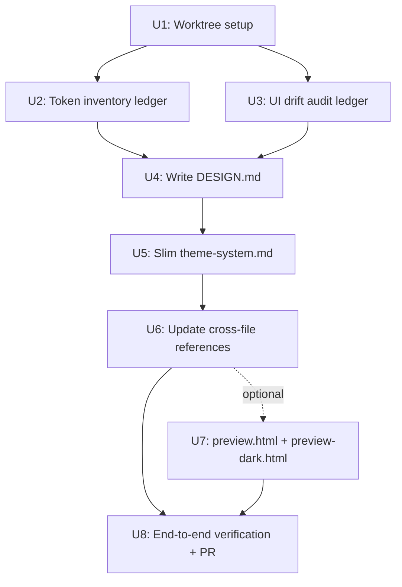

# OnMyAgent DESIGN.md - Plan

## Goal Capsule

**Objective.** Introduce `DESIGN.md` at the repo root as the authoritative visual contract for OnMyAgent's UI. It serves two roles: (1) a north star for auditing current UI inconsistency, and (2) a machine-readable contract that AI coding agents (Codex, Claude) consume when generating new UI. Simultaneously, slim `docs/design/theme-system.md` down to a design-philosophy narrative so `DESIGN.md` becomes the single source of truth for tokens and component contracts.

**Product authority.** Documentation + design-system contract change. No runtime code behavior changes. UI refactor work that follows this plan is out of scope for this artifact.

**Open blockers.** None. All Phase 1.3 gaps resolved in Q1-Q6 + Integration Check.

---

## Product Contract

### Problem Frame

OnMyAgent's UI has drifted into visible inconsistency (user's own judgment). Design values (colors, typography, radii, component contracts) currently live scattered across `apps/app/src/styles/colors.css`, `apps/app/src/app/index.css`, `apps/app/tailwind.config.ts`, `docs/design/theme-system.md`, `docs/design/ui-primitive-refactor-best-practices.md`, and 41 `apps/app/src/components/ui/*.tsx` + 11 `apps/app/src/react-app/design-system/*.tsx` files. There is no single artifact that AI coding agents can read to generate UI that stays visually consistent with the product.

Existing docs (`theme-system.md`, `ui-primitive-refactor-best-practices.md`) are written for humans and split across two files, with token values duplicated in code. Google Stitch's `DESIGN.md` spec (adopted by getdesign.md's 73-site catalog) is emerging as the standard machine-readable format for this exact problem.

### Primary Actor

**AI coding agents** (Codex, Claude) generating or modifying OnMyAgent UI, with **human readers** (project owner + future contributors + designers) as secondary readers who can also comprehend the artifact.

### Core Outcome

`DESIGN.md` becomes the authoritative single source of truth for OnMyAgent's visual language:
- Agents generating new UI reach for `DESIGN.md` tokens and component contracts, producing UI that matches product voice on the first try.
- When code drift is detected against `DESIGN.md`, the default remediation is to fix code (not to update `DESIGN.md`), preserving the north-star property.
- Humans can read the narrative sections to understand design intent without parsing YAML.

### Positioning

`DESIGN.md` is the sole authority for tokens (colors, typography, radii, spacing, component contracts). It lives at the repo root alongside `AGENTS.md`, mirroring the Stitch/getdesign.md convention: `AGENTS.md` = engineer contract, `DESIGN.md` = visual contract.

`docs/design/theme-system.md` is slimmed to pure design-philosophy narrative (Flat first, Decision first, Blunt geometry, Signal cyan, no shadows, rail three-tier surface hierarchy). All concrete token tables in `theme-system.md` are replaced by references to `DESIGN.md`. `docs/design/ui-primitive-refactor-best-practices.md` is unchanged in structure; references to `theme-system.md` tokens are updated to point at `DESIGN.md`.


### Scope

**In-scope (v1)**

- **R1.** Write `DESIGN.md` at repo root following Google Stitch `DESIGN.md` v-alpha spec (YAML front-matter with `colors` / `typography` / `rounded` / `spacing` / `components` + narrative 9-section body).
- **R2.** Cover 41 `apps/app/src/components/ui/*.tsx` shadcn atoms (full) + 5-6 high-frequency cross-domain composites from `apps/app/src/react-app/design-system/*.tsx`: `flyout-item`, `select-menu`, `text-input`, `extension-mesh-avatar`, `provider-icon`, plus one row primitive from `components/ui/action-row.tsx`. Domain-specific composites (`extension-card`, `restriction-notice-modal`, `web-unavailable-surface`, `workspace-icon`) are v2.
- **R3.** Encode OnMyAgent design principles verbatim in the narrative body: Flat first (no component shadows), Decision first (primary/create/approve/submit visually stronger than passive nav), Blunt geometry (rounded rectangles, avoid pills for CTAs), Signal cyan reserved for activity/online/running (never primary CTA).
- **R4.** Encode hard constraints in Do's and Don'ts: even-number typography scale only (no 11px/13px/15px/`text-[Npx]`), no `shadow-*` on components, `mac:titlebar-no-drag` required on all Electron macOS titlebar/sidebar-header buttons, i18n mandatory for all user-visible strings (no hardcoded language), no `any` / `as any` / `as unknown as` in code that references these tokens.
- **R5.** Slim `docs/design/theme-system.md` to design-philosophy narrative. Remove all concrete Palette, Semantic Tokens, Type Scale, Radius Scale, Button Scale, Row Button Primitives tables. Replace each removed table with a one-line pointer to the corresponding `DESIGN.md` section.
- **R6.** Update all references to `theme-system.md` token content across the repo: `AGENTS.md` documentation navigation table, `docs/README.md` entry table, `docs/design/ui-primitive-refactor-best-practices.md`, `README.md` and `README-zh.md` quick links. Add `DESIGN.md` as a new top-level entry pointing to root.
- **R7.** Produce a UI drift audit as a local `.loop/plans/ui-drift-audit.md` ledger (not committed) by running the `frontend-primitive-refactor` skill's `ui-primitive-scan.sh` against the current tree, categorized by violation type (hardcoded hex, odd typography, ad-hoc buttons, residual shadows, missing `mac:titlebar-no-drag`, hardcoded `w-*` / `h-*` violating primitive sizes) with top-5 occurrence sites + counts per category.

**Optional v1 (produce if time permits, do not block)**

- **R8.** `docs/design/preview.html` + `preview-dark.html` — visual catalog rendering `DESIGN.md`'s color swatches, type scale, and top ~10 components in both light and dark themes, following getdesign.md's per-site preview convention. If time is short, skip and note as a v2 candidate in the plan's Outstanding Questions.

**Out-of-scope (v1)**

- Domain-specific composite primitives (`extension-card`, `restriction-notice-modal`, `web-unavailable-surface`, `workspace-icon`).
- Automated token extraction script (`scripts/design/extract-tokens.mjs`).
- Enforcement gate (`pnpm check:design` comparing code tokens against `DESIGN.md`).
- Motion / animation tokens.
- Actual UI refactor work driven by the audit ledger. `DESIGN.md` defines the target state; fixing code drift is subsequent multi-round `frontend-primitive-refactor` work, tracked separately.
- Responsive breakpoint system beyond desktop Electron. OnMyAgent is a desktop-first product; responsive rules stay narrow to titlebar / rail collapse behavior.

### Success Criteria

**Primary (must hold at v1 delivery)**

- **AC1.** Project owner reviews `DESIGN.md` end-to-end and confirms it is readable, useful, and coherent with existing OnMyAgent visual identity.
- **AC2.** One real UI generation task is executed against `DESIGN.md` (e.g., "add a new empty state to the plugins page" or "generate a new dialog for X"). Result is judged materially better than agent output without `DESIGN.md` — cleaner primitive reuse, correct tokens, fewer manual corrections.

**Secondary (nice to observe, not blocking)**

- `theme-system.md` slimming does not break any tracked cross-repo link (verified by `rg` scan for old anchors).
- The UI drift audit ledger contains actionable top-5 sites per category, enabling a follow-up `frontend-primitive-refactor` round to start immediately.

### Authority Model

- **`DESIGN.md` is authoritative.** When code tokens conflict with `DESIGN.md`, code is wrong. Default remediation: change code to match `DESIGN.md`.
- **Exception path.** If `DESIGN.md` is itself demonstrably wrong (visual bug, contradicts product decisions), update `DESIGN.md` first, then align code. Record the decision in the audit ledger or a subsequent plan.
- **v1 enforcement.** Human discipline only: `frontend-primitive-refactor` skill runs triggered audits (after UI refactors, periodically) and the project owner arbitrates. No CI gate.
- **v2 enforcement (deferred).** A `pnpm check:design` script would parse `DESIGN.md` YAML and compare against code token values in `styles/colors.css` / `app/index.css` / `tailwind.config.ts` / primitive defaults. Failure blocks merge. Out of scope for v1.

### Maintenance Model

- **v1: manual, event-driven.** `DESIGN.md` is not updated per PR. Owner or an agent runs the `frontend-primitive-refactor` skill after every non-trivial UI refactor and after any change to token source files. Any drift found routes to "fix code" (default per Authority Model) or, if `DESIGN.md` is wrong, to a plan update.
- **v2: assisted.** Introduce token-extraction diff tooling and optionally the enforcement gate above.


### Actors

- **A1.** Project owner (li ying kun) — final reviewer, arbitrator on `DESIGN.md` vs code conflicts.
- **A2.** AI coding agents (Codex, Claude, OpenCode-based agents) — primary consumers, generate UI reading `DESIGN.md` YAML front-matter and Do's/Don'ts.
- **A3.** Future human contributors and designers — read narrative sections + optional `preview.html` for design intent.

### Key Flows

- **F1. Agent generates new UI.** Agent reads `DESIGN.md` (root) → picks tokens from YAML → picks nearest primitive from `components` table → generates code that respects Do's/Don'ts → produces UI aligned with product voice.
- **F2. Human audits UI drift.** Owner or agent runs `frontend-primitive-refactor` skill → produces drift ledger at `.loop/plans/ui-drift-audit.md` → decides per-site: fix code (default) or update `DESIGN.md`.
- **F3. Design decision changes.** Product owner decides a new design direction (e.g., new signal color, new primitive) → updates `DESIGN.md` first → schedules code migration via `frontend-primitive-refactor` plan.

### Acceptance Examples

- **AE1.** Agent is asked "add an empty state to the plugins settings page". Without `DESIGN.md`, agent may hardcode `#F5F5F5`, use `text-[13px]`, and wrap in a custom div. With `DESIGN.md`, agent uses `--dls-surface-muted`, picks even-scale typography, and reaches for `Empty` primitive from `components/ui/empty.tsx`. Owner's manual correction count drops.
- **AE2.** Owner runs the drift audit and finds 12 sites using `shadow-sm`. Since `DESIGN.md` says "Flat first: no component shadows", default action is "remove shadow from those 12 sites" — not "add shadow to `DESIGN.md`".
- **AE3.** Owner reviewing `DESIGN.md` finds a token value that no longer matches product intent (e.g., signal cyan is too saturated for dark theme). Owner updates `DESIGN.md`, then a follow-up `frontend-primitive-refactor` plan migrates the code CSS variable.

### Constraints

- **C1.** Must follow Stitch `DESIGN.md` v-alpha spec (YAML front-matter shape: `colors`, `typography`, `rounded`, `spacing`, `components` + 9-section narrative body: Visual Theme, Color Palette, Typography, Component Stylings, Layout, Depth, Do's/Don'ts, Responsive, Agent Prompt Guide).
- **C2.** Repo AGENTS.md hard rules apply verbatim to the plan and its writing process:
  - Multi-collaborator safety: check `git status --short --branch` before starting, do not silently overwrite others' changes, no `git reset --hard` / `git checkout -- .` / `git restore .` / `git clean -fd` / `git push --force`.
  - Path permissions: `AGENTS.md`, `README.md`, `README-zh.md`, `docs/**`, `apps/**`, `packages/**` allowlisted; `.env*` denylisted. New `DESIGN.md` at root is allowed under existing allowlist patterns.
  - Loop rules: L2 assist tier, local-only `.loop/` ledgers, dev-time typecheck and boundary gates apply to any code touched.
  - Even-number typography, no shadows, `mac:titlebar-no-drag`, i18n hard constraints all quoted into DESIGN.md's Do's/Don'ts.
- **C3.** Current git tree has an unresolved merge conflict on `apps/app/src/react-app/domains/session/chat/personal-local-agent-page.tsx` (`UU`) plus ~20 dirty files under the migrate-studio-local-agent branch. Any `DESIGN.md` work must not merge into this dirty state. `ce-worktree` should create an isolated `codex/design-md-v1` worktree from a clean base before implementation begins.

### Dependencies

- **D1.** `frontend-primitive-refactor` skill and its `ui-primitive-scan.sh` script must be functional. Available at `.codex/skills/frontend-primitive-refactor/`.
- **D2.** Existing `docs/design/theme-system.md` and `docs/design/ui-primitive-refactor-best-practices.md` remain in place (theme-system.md gets slimmed).
- **D3.** No new tools, libraries, or CI changes required for v1.

### Assumptions

- **AS1.** "Audit" scope means "produce a categorized ledger", not "fix UI drift in this round". Actual UI fixes are subsequent multi-round `frontend-primitive-refactor` work.
- **AS2.** Desktop macOS Electron is the primary platform. Responsive rules are minimal (only titlebar / rail collapse and minimum window width). Not a mobile-web-responsive product.
- **AS3.** Chinese and English i18n are hard requirements. All user-visible strings must go through the existing i18n system; hardcoded language is a `DESIGN.md` Do-not.
- **AS4.** `preview.html` is a nice-to-have. If it materially delays v1, defer to v2. Baseline v1 delivery is `DESIGN.md` + slimmed `theme-system.md` + drift ledger.

### Outstanding Questions (defer to `ce-plan` or future rounds)

- **OQ1.** Should `preview.html` land in v1 or v2? Depends on time available and whether owner wants visual verification before committing.
- **OQ2.** What is the final section list for the slimmed `theme-system.md`? Likely candidates: Design Direction, Type Scale narrative rules, Motion (v1 keeps motion narrative), Rules, Intentional Exceptions, Token Debt Guardrails. Detailed slim scope decided during `ce-plan`.
- **OQ3.** Audit trigger cadence — "after every UI refactor" vs "quarterly" vs "ad-hoc"? v1 leaves this ad-hoc; may formalize in v2.
- **OQ4.** How many high-frequency composite primitives make v1's YAML `components` table? Baseline is 5-6 (named in R2). Exact list confirmed during `ce-plan` after reading composite source files.
- **OQ5.** Should the drift ledger name specific `frontend-primitive-refactor` follow-up rounds (one per category)? v1 leaves ledger as a flat list; sequencing is a separate planning decision.

### Sources

- Google Stitch `DESIGN.md` v-alpha specification: `https://stitch.withgoogle.com/docs/design-md/overview/` and `https://stitch.withgoogle.com/docs/design-md/specification/`.
- getdesign.md `awesome-design-md` catalog: `https://github.com/VoltAgent/awesome-design-md` (73 sites, extended 9-section format).
- Existing repo docs: `docs/design/theme-system.md`, `docs/design/ui-primitive-refactor-best-practices.md`, `apps/app/src/react-app/ARCHITECTURE.md`, `AGENTS.md`, `docs/Architecture.md`, `docs/README.md`.
- Repo skills: `.codex/skills/frontend-primitive-refactor/SKILL.md`, `.codex/skills/documentation-audit/SKILL.md`, `.codex/skills/ui-regression-audit/SKILL.md`.
- Brainstorm dialogue Q1-Q6 + Integration Check (this session, 2026-07-04).

---

## Planning Contract

**Product Contract preservation.** Unchanged. Planning enriches this artifact from `requirements-only` to `implementation-ready` without rewriting product scope, requirements, actors, or acceptance examples.

### Approach

Enrich in place. Seven implementation units, executed on an isolated `codex/design-md-v1` worktree from a clean base (avoids the current `migrate-studio-local-agent` branch's unresolved merge conflict and dirty state). Two units run in parallel after the worktree is up (token inventory + drift scan); the rest are sequential due to referential dependencies.

Doc-first work with lightweight verification: no unit tests (no code behavior changes), but every unit has explicit verification outcomes — `rg` link scans, `git diff --check`, headed `pnpm check:type` as a defensive gate, human end-to-end review, and one real UI-generation dogfooding pass against `DESIGN.md`.

### Key Technical Decisions

- **KTD1.** DESIGN.md lives at repo root, mirroring the Stitch `AGENTS.md` / `DESIGN.md` twin-contract convention. Not `docs/DESIGN.md`, not `docs/design/DESIGN.md`. Rationale: AI agents discover root-level contracts by convention; nesting reduces discoverability.
- **KTD2.** Follow Stitch v-alpha spec verbatim: YAML front-matter with `colors` / `typography` / `rounded` / `spacing` / `components` maps, then a 9-section narrative body (Visual Theme & Atmosphere / Color Palette & Roles / Typography Rules / Component Stylings / Layout Principles / Depth & Elevation / Do's and Don'ts / Responsive Behavior / Agent Prompt Guide). Rationale: getdesign.md's 73-site catalog uses this format; deviating from the spec forfeits ecosystem tooling compatibility.
- **KTD3.** Colors map holds both light and dark values on the same key, using a nested object `{ light: '#hex', dark: '#hex' }` per token. Rationale: single-map access for agents; forces symmetric palettes.
- **KTD4.** DESIGN.md becomes the single source of truth for tokens; `docs/design/theme-system.md` is slimmed to five narrative sections (Design Direction / Motion / Rules / Intentional Exceptions / Token Debt Guardrails). All concrete tables in theme-system.md — Palette, Semantic Tokens, Type Scale table, Radius Scale, Scrollbars specifics, Button Scale, Row Button Primitives — are removed. Each removed section is replaced with a one-line pointer to the corresponding DESIGN.md section. Rationale: matches Q3 Integration decision (DESIGN.md authoritative); prevents token drift between two documents.
- **KTD5.** Cross-file reference update scope is limited to five documents: `AGENTS.md`, `docs/README.md`, `README.md`, `README-zh.md`, `docs/design/ui-primitive-refactor-best-practices.md`. Do NOT modify code files that consume tokens (`apps/app/src/styles/colors.css`, `apps/app/src/app/index.css`, `apps/app/tailwind.config.ts`, `apps/app/src/components/ui/*.tsx`). Rationale: token consumer alignment is subsequent `frontend-primitive-refactor` work; this plan defines the target, not the migration.
- **KTD6.** UI drift audit ledger lands at `.loop/plans/ui-drift-audit.md` (local-only per repo AGENTS.md `.loop/` convention), not `docs/`. Rationale: ledger is a working document consumed by follow-up refactor rounds, not a durable design artifact.
- **KTD7.** `preview.html` is a v1 stretch goal (U7), not a blocking deliverable. If time runs short, U7 is dropped and its OQ resurfaces in Open Questions. Rationale: DESIGN.md YAML + narrative is agent-consumable without a visual preview; preview aids humans and is easy to add later.
- **KTD8.** All seven units execute on isolated worktree `codex/design-md-v1` created via `ce-worktree`. Main checkout (`migrate-studio-local-agent`) stays untouched. Rationale: repo AGENTS.md multi-collaborator rules forbid mixing unrelated work; current tree has an unresolved merge conflict (`UU apps/app/src/react-app/domains/session/chat/personal-local-agent-page.tsx`).
- **KTD9.** Single PR, one atomic commit per U-ID for review clarity. PR title: `feat(design): introduce DESIGN.md as authoritative visual contract`. Rationale: cross-file references must land together; splitting into two PRs risks broken link windows.

### High-Level Technical Design



U2 and U3 run in parallel after U1 (both read code without mutating it). U4 needs U2 and U3 as input. U5 needs U4 (points at DESIGN.md sections). U6 needs U5 (adjusts navigation entries). U7 optional between U6 and U8. U8 is the final verification + PR gate.


### Output Structure

```text
onmyagent/
├── DESIGN.md                                      # NEW (U4) — root visual contract
├── AGENTS.md                                      # MODIFY (U6) — docs nav table adds DESIGN.md row
├── README.md                                      # MODIFY (U6) — quick link + short mention
├── README-zh.md                                   # MODIFY (U6) — 快速链接 + 简短说明
├── docs/
│   ├── README.md                                  # MODIFY (U6) — entry table adds DESIGN.md
│   └── design/
│       ├── theme-system.md                        # MODIFY (U5) — slim to 5 narrative sections
│       ├── ui-primitive-refactor-best-practices.md # MODIFY (U6) — retarget token refs to DESIGN.md
│       ├── preview.html                           # NEW (U7 optional) — light-theme visual catalog
│       └── preview-dark.html                      # NEW (U7 optional) — dark-theme visual catalog
└── .loop/plans/
    ├── design-md-tokens.md                        # NEW (U2) — local ledger, gitignored
    └── ui-drift-audit.md                          # NEW (U3) — local ledger, gitignored
```

The `.loop/plans/` files are local-only per repo convention. They are inputs and audit outputs, never committed.

---

## Implementation Units

### U1. Create isolated worktree via ce-worktree

**Goal.** Set up an isolated `codex/design-md-v1` git worktree from a clean base so DESIGN.md work does not merge into the current `migrate-studio-local-agent` branch's dirty state and unresolved merge conflict.

**Requirements.** C3 (repo AGENTS.md multi-collaborator safety).

**Dependencies.** None.

**Files.** No repo file changes; worktree scaffolding only.

**Approach.** Invoke the `compound-engineering:ce-worktree` skill in **New work mode**. Branch name: `codex/design-md-v1`. Base: `origin/main` when reachable, else local `main`. Worktree path: `.worktrees/codex-design-md-v1` under repo root. All subsequent units execute from within that worktree.

Before invoking `ce-worktree`, confirm with the user that they want to leave `migrate-studio-local-agent`'s unresolved merge conflict for a separate session — this plan does not touch that conflict.

**Patterns to follow.** `ce-worktree` skill Step 0 (detect existing isolation) then Step 2 (git fallback) since Codex has no native worktree tool. `.worktrees/` should already be gitignored; if not, add it before creating.

**Test scenarios.** `Test expectation: none -- worktree setup has no behavioral surface to test.`

**Verification.**
- `git worktree list` shows `.worktrees/codex-design-md-v1` on branch `codex/design-md-v1`.
- `git status --short --branch` in the new worktree shows a clean tree on the new branch.
- The original checkout at `/Users/work/code/weaveq/onmyagent` is untouched — its `migrate-studio-local-agent` state and `UU` conflict on `personal-local-agent-page.tsx` remain exactly as before.

### U2. Token inventory ledger

**Goal.** Produce a comprehensive local ledger of every design token currently in code (colors, typography, radii, spacing, primitive default contracts) so U4 has an authoritative source to encode into DESIGN.md's YAML front-matter.

**Requirements.** R1 (agent-readable YAML), R2 (component coverage), R5 (theme-system slim without loss).

**Dependencies.** U1.

**Files.**
- `.loop/plans/design-md-tokens.md` — new local ledger, not committed.
- Read-only inputs:
  - `apps/app/src/styles/colors.css` (Radix palette raw values).
  - `apps/app/src/app/index.css` (semantic tokens: `--dls-*`, `--ow-*`, light and dark).
  - `apps/app/tailwind.config.ts` (spacing, rounded, breakpoints).
  - `apps/app/src/components/ui/button.tsx`, `input.tsx`, `dialog.tsx`, `card.tsx`, `action-row.tsx`, `status-badge.tsx`, `status-dot.tsx`, `code-token.tsx`, `notice-box.tsx`, `send-button.tsx`, `select.tsx`, `separator.tsx`, `sheet.tsx`, `label.tsx`, `field.tsx`, `input-group.tsx` (top-15 shadcn atoms for v1 YAML `components` map).
  - `apps/app/src/react-app/design-system/flyout-item.tsx`, `select-menu.tsx`, `text-input.tsx`, `extension-mesh-avatar.tsx`, `provider-icon.tsx` (5 cross-domain composites).

**Approach.** Ledger has five sections mirroring DESIGN.md's YAML front-matter shape:
1. **colors** — every `--dls-*` and `--ow-*` token with light + dark hex values, grouped by role (surface / text / primary / signal / border).
2. **typography** — the type scale from `docs/design/theme-system.md` cross-verified against actual usage in code; flag any odd-size violations found for U3's drift ledger.
3. **rounded** — from `tailwind.config.ts` plus any hardcoded `rounded-[Npx]` occurrences.
4. **spacing** — Tailwind default scale plus any custom values from config.
5. **components** — for each of the 15 atoms + 5 composites, extract default `size` / `padding` / `height` / `rounded` / `typography` triple as it appears in the component's default variant.

Use `rg` for extraction; do not modify source files. Note in the ledger any token that has no clean semantic name (a candidate for renaming in DESIGN.md).

**Patterns to follow.** `docs/design/theme-system.md`'s table shape for palette and type scale.

**Test scenarios.** `Test expectation: none -- ledger is scan output, not behavior.`

**Verification.**
- Ledger contains sections 1–5 with values, not placeholders.
- Every `--dls-*` and `--ow-*` variable defined in `apps/app/src/app/index.css` appears in section 1 (spot-check by counting definitions with `rg '^\s*--dls-|--ow-' apps/app/src/app/index.css | wc -l` and comparing to ledger row count).
- All 20 listed component files have an entry in section 5.
- User reviews ledger; approves before proceeding to U4.


### U3. UI drift audit ledger

**Goal.** Produce a categorized local ledger of every current UI inconsistency, so DESIGN.md's Do's/Don'ts section can be grounded in real violations and subsequent `frontend-primitive-refactor` rounds have a prioritized backlog.

**Requirements.** R7 (drift audit).

**Dependencies.** U1. Runs in parallel with U2.

**Files.**
- `.loop/plans/ui-drift-audit.md` — new local ledger, not committed.
- Read-only inputs: entire `apps/app/src/**` (scoped by the audit script).

**Approach.** Invoke the project-local `.codex/skills/frontend-primitive-refactor/SKILL.md` skill. Run its `ui-primitive-scan.sh` script from the worktree root. Post-process results into a ledger with six categories, each showing top-5 occurrence sites plus total count:

1. Hardcoded hex colors (any `#RRGGBB` in `.tsx` not routed through a token).
2. Odd typography (`text-[11px]`, `text-[13px]`, `text-[15px]`, or any `text-[Npx]` where N is odd).
3. Ad-hoc buttons (raw `<button>` elements or private `Button`-like components not using `components/ui/button.tsx`).
4. Residual shadows (any `shadow-*` class on non-modal, non-tooltip components — the Flat first rule).
5. Missing `mac:titlebar-no-drag` on Electron macOS titlebar/sidebar-header interactive elements (verify by `rg` matching known titlebar file paths).
6. Hardcoded sizes (`w-[Npx]`, `h-[Npx]`) that override primitive default sizes.

For each category, note whether the violation is a candidate for auto-fix or requires design judgment.

**Patterns to follow.** `.codex/skills/frontend-primitive-refactor/SKILL.md` workflow, especially the "classify hits as convert, keep, or review" step.

**Test scenarios.** `Test expectation: none -- audit is scan output, not behavior.`

**Verification.**
- Ledger contains 6 categorized sections with counts, top-5 sites, and category-level auto-fix judgment.
- If a category returns zero violations, ledger explicitly notes "zero violations found" rather than omitting the section.
- The scan command was actually run (not simulated) — the ledger cites the exact command executed and its output timestamp.

### U4. Write DESIGN.md at repo root

**Goal.** Author the authoritative `DESIGN.md` following Stitch v-alpha spec: YAML front-matter (colors / typography / rounded / spacing / components) + 9-section narrative body encoding OnMyAgent's visual identity.

**Requirements.** R1, R2, R3, R4.

**Dependencies.** U2 (token inventory), U3 (drift categories inform Do's/Don'ts).

**Files.**
- `DESIGN.md` — new at repo root.
- Read inputs: `.loop/plans/design-md-tokens.md`, `.loop/plans/ui-drift-audit.md`, `docs/design/theme-system.md`, `AGENTS.md` (for hard constraints).

**Approach.** Compose in three passes:

**Pass 1 — YAML front-matter.** Populate five maps from U2 ledger verbatim. Colors use nested `{ light, dark }` values (KTD3). Component contracts include state variants (default / hover / active / disabled) where the atom's variant table defines them. Follow getdesign.md's Claude example (`design-md/claude/DESIGN.md`) for structural reference — copy the shape, not the content.

**Pass 2 — 9 narrative sections.**
1. **Visual Theme & Atmosphere** — flat-first, decision-first, blunt geometry, signal cyan, rail three-tier surface hierarchy (mood + density).
2. **Color Palette & Roles** — each color's semantic role and canonical usage; explicit "signal cyan is NEVER a primary CTA" rule.
3. **Typography Rules** — even-scale rule stated as jussive ("Font sizes use even-number tokens only"); type hierarchy table by role.
4. **Component Stylings** — for each primitive in the YAML `components` map, one paragraph on when to reach for it and what states are provided.
5. **Layout Principles** — spacing scale, `--dls-app-bg` / `--dls-background` / `--dls-surface` / `--dls-rail-bg` four-tier surface strategy, density basis.
6. **Depth & Elevation** — the "no component shadows" rule stated bluntly; use border, surface contrast, spacing, text weight, and active states for hierarchy.
7. **Do's and Don'ts** — encode from AGENTS.md's hard constraints AND U3's drift categories:
   - Do use even-number typography tokens; Don't use `text-[11px]` / `text-[13px]` / `text-[15px]` or any `text-[Npx]` with odd N.
   - Do use `--dls-*` / `--ow-*` semantic tokens; Don't hardcode `#RRGGBB` values in components.
   - Do route buttons through `components/ui/button.tsx`; Don't write raw `<button>` elements or private clones.
   - Don't apply `shadow-*` classes on components; use border, surface contrast, and text weight for hierarchy.
   - Do add `mac:titlebar-no-drag` to every interactive element inside macOS titlebar / sidebar-header regions; Don't rely on default click-through in Electron dragged regions.
   - Do wrap all user-visible strings through the existing i18n system; Don't hardcode English or Chinese strings.
   - Do use `Button` / `Input` / `Dialog` / `Card` primitives at their default sizes; Don't override with hardcoded `w-[Npx]` / `h-[Npx]` unless the design system explicitly names an exception.
   - Don't use `any`, `as any`, or `as unknown as` in code that references design tokens (enforced by `pnpm check:forbidden-types`).
8. **Responsive Behavior** — desktop-first premise, titlebar and rail-collapse rules, minimum viable window width, no mobile-web breakpoint system.
9. **Agent Prompt Guide** — quick color swatch reference + 3–5 copy-paste prompt templates:
   - "Generate an empty state for [page]. Read `DESIGN.md` and use `components/ui/empty.tsx`, `--dls-surface-muted` background, and `title-md` typography."
   - "Add a new dialog for [purpose]. Wrap in `Dialog` primitive; do not shadow; use `--dls-surface` background."
   - "Introduce a new status row. Use `ActionRow` primitive; put the status through `StatusDot` or `StatusBadge`; never invent a private row wrapper."

**Pass 3 — cross-doc pointers.** In Component Stylings and Typography Rules, add "See also: `docs/design/theme-system.md`'s Design Direction / Motion / Rules for the design philosophy narrative" pointers so human readers can navigate to the slimmed narrative.

**Execution note.** Author against a checklist: every DESIGN.md section must reference either a token in U2's ledger, a rule in AGENTS.md, or a drift category in U3's ledger. Anything that cannot be traced back to one of those three sources is speculation and should be dropped or moved to Outstanding Questions.

**Patterns to follow.**
- `docs/design/theme-system.md` for token names and design-language voice.
- Google Stitch specification: `https://stitch.withgoogle.com/docs/design-md/specification/`.
- Reference DESIGN.md from getdesign.md's Claude sample: shape only, not content.

**Test scenarios.** `Test expectation: none -- documentation authoring; verification is human review.`

**Verification.**
- DESIGN.md exists at repo root and is well-formed markdown (YAML front-matter parses without error under any standard YAML parser).
- Every `--dls-*` and `--ow-*` token from U2 ledger section 1 appears in DESIGN.md's `colors` map.
- All 8 typography scale steps from `docs/design/theme-system.md` appear in the `typography` map.
- All 20 component contracts from U2 ledger section 5 appear in the `components` map.
- Do's and Don'ts section has one Do/Don't pair per U3 drift category (6 categories) plus AGENTS.md hard constraints (typography, i18n, `mac:titlebar-no-drag`, forbidden types).
- `git diff --check DESIGN.md` reports no whitespace errors.


### U5. Slim docs/design/theme-system.md to design-philosophy narrative

**Goal.** Reduce `docs/design/theme-system.md` from 175 lines of mixed narrative + tables to a pure design-philosophy narrative covering five sections. Every removed section is replaced by a one-line pointer to DESIGN.md.

**Requirements.** R5 (theme-system slim), preserves KTD4 (token single source of truth).

**Dependencies.** U4 (DESIGN.md must exist and have stable section anchors for pointer text).

**Files.** `docs/design/theme-system.md` — modify in place.

**Approach.**

Keep these sections (narrative only, no tables):
- **Design Direction** — the flat-first / decision-first / blunt-geometry / signal-cyan mission statement.
- **Motion** — motion tokens and animation philosophy (current content preserved; no runtime motion token duplicates in DESIGN.md v1).
- **Rules** — the design rules paragraph (not the tables).
- **Intentional Exceptions** — where and why the design system permits deviation.
- **Token Debt Guardrails** — the guardrail principles paragraph.

Remove and replace with a one-line pointer:
- Palette table → `> Palette token values are canonical in root-level DESIGN.md; see the DESIGN.md ` `colors` ` map.`
- Semantic Tokens table → `> Semantic tokens (` `--dls-*` `, ` `--ow-*` `) are canonical in root-level DESIGN.md; see the DESIGN.md ` `colors` ` map's semantic role grouping.`
- Type Scale table → `> Type scale values are canonical in root-level DESIGN.md; see the DESIGN.md ` `typography` ` map.`
- Radius Scale → pointer to DESIGN.md ` `rounded` ` map.
- Scrollbars-specific numeric rules → keep the design intent as narrative; move exact pixel values to DESIGN.md's Component Stylings scrollbar entry.
- Button Scale → pointer to DESIGN.md ` `components.button-*` ` entries.
- Row Button Primitives → pointer to DESIGN.md ` `components.action-row` ` entry.

At the top of the slimmed theme-system.md, add a preface paragraph:

> This document holds OnMyAgent's design-philosophy narrative — the *why* behind the visual language. All concrete token values, primitive contracts, and enforcement rules live in the repo-root `DESIGN.md`, which is the authoritative source. When code diverges from `DESIGN.md`, fix the code.

**Execution note.** After slimming, cross-check that every token or table this file previously listed has a live corresponding entry in DESIGN.md. Any deletion without a target is a bug — restore the section or fill the DESIGN.md gap first.

**Patterns to follow.** Existing narrative voice of `docs/design/theme-system.md`. Do not change tone.

**Test scenarios.** `Test expectation: none -- documentation slim; verification is link scan + human read.`

**Verification.**
- File length reduced from ~175 lines to roughly 60–80 lines.
- No table blocks remain (verify with `rg '^\|' docs/design/theme-system.md` returns zero rows).
- Every removed section has a pointer sentence naming a DESIGN.md section that actually exists (verify by grepping DESIGN.md for each named section).
- Preface paragraph is at the top of the file, before Design Direction.
- The rest of the narrative reads coherently top to bottom.

### U6. Update cross-file references to DESIGN.md

**Goal.** Wire the new DESIGN.md into repo navigation so agents and humans can discover it. Retarget outdated theme-system.md token pointers in `ui-primitive-refactor-best-practices.md` to DESIGN.md.

**Requirements.** R6.

**Dependencies.** U5 (theme-system.md structure must be final so pointer text is stable).

**Files.**
- `AGENTS.md` — modify documentation navigation table to include a new row for DESIGN.md.
- `docs/README.md` — modify entry table to include DESIGN.md as a top-level entry.
- `README.md` — add short paragraph in the section that introduces `AGENTS.md`, noting `DESIGN.md` as its visual counterpart.
- `README-zh.md` — same edit as README.md, in Chinese.
- `docs/design/ui-primitive-refactor-best-practices.md` — retarget any references to `theme-system.md`'s token tables so they now point at DESIGN.md. Keep references to theme-system.md's philosophy narrative unchanged.

**Approach.**

- **AGENTS.md documentation nav table.** Insert a new row before the current `docs/README.md` entry:

  ```
  | `DESIGN.md` | 视觉契约：token 权威源、primitive 契约、Do's/Don'ts；AI agent 生成 UI 的输入。 |
  ```

  Also update the `Iron Law` section's "must first read and follow relevant Skill and this file rules" clause to add "and `DESIGN.md`" when the work touches UI.

- **docs/README.md entry table.** Add DESIGN.md row above `Architecture.md`:

  ```
  | `../DESIGN.md` | Authoritative visual contract: tokens, component contracts, Do's/Don'ts. |
  ```

- **README.md.** In the section that introduces AGENTS.md, add:

  ```
  For AI-generated UI, agents also read root-level `DESIGN.md` — the visual counterpart to `AGENTS.md`. See it for tokens, component contracts, and design guardrails.
  ```

- **README-zh.md.** Chinese equivalent:

  ```
  对于 AI 生成的 UI，agent 还会读根目录的 `DESIGN.md`——`AGENTS.md` 的视觉对应文件。包含 token、组件契约与设计护栏。
  ```

- **ui-primitive-refactor-best-practices.md.** `rg 'theme-system.md' docs/design/ui-primitive-refactor-best-practices.md` — for each hit, determine whether the reference points at a slimmed narrative section (keep unchanged) or a removed token table (retarget to DESIGN.md). If ambiguous, prefer DESIGN.md for token-related content.

**Patterns to follow.** Existing table row shape in AGENTS.md and docs/README.md. Existing README bilingual structure.

**Test scenarios.** `Test expectation: none -- reference plumbing; verification is grep + link scan.`

**Verification.**
- `rg 'DESIGN\.md' AGENTS.md docs/README.md README.md README-zh.md` returns at least one hit per file.
- `rg 'theme-system\.md' docs/design/ui-primitive-refactor-best-practices.md` — every remaining hit points at a section that still exists in the slimmed theme-system.md.
- No broken links: `rg 'DESIGN\.md#' <all modified files>` — every anchor points at a heading that exists in DESIGN.md (spot-check).
- `git diff --check` reports no whitespace errors on any modified file.


### U7. preview.html and preview-dark.html (stretch, optional)

**Goal.** Produce two static HTML files that render DESIGN.md's palette, type scale, and top ~10 components in light and dark themes so humans can visually verify DESIGN.md's tokens at a glance.

**Requirements.** R8 (optional).

**Dependencies.** U6 (all references stable — preview links back to DESIGN.md).

**Files.**
- `docs/design/preview.html` — new, light theme.
- `docs/design/preview-dark.html` — new, dark theme.

**Approach.** Static HTML/CSS only, no framework, no build step. Structure follows the getdesign.md preview convention: a color swatch grid (each swatch shows role name + hex), a type scale ladder (largest to smallest, each row shows the token name and rendered sample text), and a component gallery for the top ~10 primitives (button variants, input states, dialog frame, action row, status badge/dot, code token, notice box). Values must match DESIGN.md's YAML exactly — no drift.

Copy-paste-friendly, no external CDNs — inline `<style>` blocks, self-contained. Both files link to each other via a small header toggle.

If time is short, drop U7 entirely and record its state as an Outstanding Question in the plan's Open Questions section. Do not ship a half-finished preview.

**Execution note.** U7 is guarded by a hard timebox. Set a 30-minute budget when starting; if exceeded, stop and drop. Preview aids humans, not agents, so v2 can add it without blocking v1's AC2 dogfooding.

**Patterns to follow.** getdesign.md's preview.html output structure (each cataloged DESIGN.md ships with light + dark previews). Do not copy Every's brand identity.

**Test scenarios.** `Test expectation: none -- static HTML with no logic.`

**Verification.**
- Both files open in a browser without console errors.
- Every color swatch's inline value matches DESIGN.md's `colors` map value at the same key.
- Every type-scale sample uses the correct `font-size` and `font-family` from DESIGN.md's `typography` map.
- User reviews the preview in both light and dark themes and confirms visual identity matches OnMyAgent's product.
- If dropped, plan's Outstanding Questions section notes U7 as deferred to v2.

### U8. End-to-end verification and PR

**Goal.** Run the full verification suite defined in the Verification Contract, then open a single PR containing all seven units' changes for atomic review.

**Requirements.** AC1, AC2.

**Dependencies.** U1–U6 (mandatory). U7 optional.

**Files.** No new files. Verifies the plan's touched files as a whole.

**Approach.**

**Step 1 — Static verification (in worktree).**
- `rg 'theme-system\.md' -l` across the repo: every match either lives in a legitimate philosophy reference (kept sections) or points at DESIGN.md via a pointer sentence added in U5.
- `rg 'DESIGN\.md' AGENTS.md README.md README-zh.md docs/README.md docs/design/ui-primitive-refactor-best-practices.md` — all discovered.
- `git diff --check` on the branch — no whitespace or conflict-marker leaks.
- `pnpm check:type` — defensive; nothing typechecks against `.md` but a stray fingerprint on a `.tsx` would surface here. Expect zero delta from baseline.

**Step 2 — AC1 (human review).** Owner reads DESIGN.md end to end and confirms:
- YAML front-matter parses; each map has the expected entries per U4 verification.
- Nine narrative sections read coherently; nothing hedges when it should command; Do's and Don'ts are jussive, not descriptive.
- Design voice matches OnMyAgent's product identity.

**Step 3 — AC2 (dogfooding, real UI-generation task).** Owner picks one concrete UI task from the current backlog (or invents one) — e.g., "add an empty state to the plugins settings page", "generate a new dialog for X", or "add a status row for Y". Ask an AI coding agent (Codex, Claude) to generate the code by reading DESIGN.md. Success criteria:
- Agent references DESIGN.md tokens (`--dls-*` / `--ow-*`) instead of hardcoding hex.
- Agent uses named primitives from `components/ui/*` instead of writing new wrappers.
- Agent respects Do's/Don'ts: even-scale typography, no shadow, i18n hook.
- Owner's manual correction count on the generated code is materially lower than a baseline "generate this without DESIGN.md" run would produce.

Record the dogfooding result briefly (5–10 lines) in `.loop/runs/2026-07-04.md` for handoff evidence.

**Step 4 — PR.** Single PR: title `feat(design): introduce DESIGN.md as authoritative visual contract`. Commit history: one commit per U-ID (U1 skipped from commit history — it is a worktree setup, not a repo change; U2 and U3 commit their local ledgers under `.loop/plans/` which are gitignored so no commit; U4, U5, U6 each get a commit; U7 gets its own commit if delivered; U8 no separate commit). PR body summarizes the seven units, links to `docs/plans/2026-07-04-001-feat-design-md-plan.md`, and calls out the theme-system.md slim as the breaking-navigation change reviewers should scan first.

**Execution note.** PR must not include any file from `apps/**`. Cross-check with `git diff --name-only origin/main...HEAD | rg '^apps/'` before pushing.

**Patterns to follow.** Repo AGENTS.md PR conventions. `ce-commit` skill for commit message shaping if needed.

**Test scenarios.** `Test expectation: none for U8 as a step -- verification IS the test.`

**Verification.**
- All Step 1 checks pass.
- Owner explicitly signs off on AC1 and AC2.
- PR opens against `main` (or the current default branch) and shows all expected files in the diff, zero from `apps/**`.


---

## Verification Contract

Because this plan produces documentation and scan output — not runtime code — verification is layered as static checks, human review, and one dogfooding pass.

### Static gates (run automatically per unit)

- **`git status --short --branch`** before U1 (multi-collab safety). Blocks if the worktree isn't clean; U1 handles this by isolating.
- **`git diff --check`** on every modified file per unit. Blocks on whitespace or conflict markers.
- **`rg` link scans** on every doc that changes: DESIGN.md exists where pointed to; theme-system.md pointers resolve; no dead references to deleted table sections.
- **`pnpm check:type`** run once at U8 as defensive gate. Documentation changes should not affect types; a non-zero delta is a signal that something outside the plan's declared scope was touched.
- **`pnpm check:boundaries`** run once at U8 as defensive gate. Same rationale.

### Human review gates

- **U2 ledger review** — owner approves the token inventory before U4 writes DESIGN.md.
- **AC1** — owner reads DESIGN.md end to end. Confirms tone, coherence, coverage.

### Dogfooding gate

- **AC2** — one real UI-generation task using DESIGN.md as input, judged materially better than baseline.

### Blocked paths

- No test files are created — no unit tests, integration tests, or e2e tests are appropriate for documentation content.
- No CI gate is added — v1 relies on human review; a `pnpm check:design` gate is a v2 candidate (OQ deferred).

---

## Definition of Done

The plan is done when all of the following hold:

1. `DESIGN.md` exists at repo root with well-formed YAML + 9 narrative sections; every U4 verification checkbox passes.
2. `docs/design/theme-system.md` is slimmed to five narrative sections with pointer sentences replacing removed tables; every U5 verification checkbox passes.
3. `AGENTS.md`, `docs/README.md`, `README.md`, `README-zh.md`, and `docs/design/ui-primitive-refactor-best-practices.md` all discover DESIGN.md via at least one live reference; U6 verification passes.
4. `.loop/plans/design-md-tokens.md` and `.loop/plans/ui-drift-audit.md` exist locally (not committed) with the coverage each unit specifies.
5. AC1 signed off — owner has read DESIGN.md end to end and approves.
6. AC2 signed off — one real UI-generation task using DESIGN.md ran and produced materially better output than baseline.
7. PR opened, title `feat(design): introduce DESIGN.md as authoritative visual contract`, diff scope excludes `apps/**` and any denylisted paths per repo AGENTS.md.
8. All static gates (`git diff --check`, `pnpm check:type`, `pnpm check:boundaries`) pass with zero delta on non-doc files.

Not required for done:

- U7 (`preview.html` files) — optional stretch goal.
- Code alignment to DESIGN.md tokens — subsequent `frontend-primitive-refactor` work.
- `pnpm check:design` enforcement gate — v2 candidate.

---

## Scope Boundaries

### In scope

Covered by U1–U8 as described. See per-unit **Goal** and **Files** sections.

### Out of scope (product-level, from origin)

- Domain-specific composite primitives (`extension-card`, `restriction-notice-modal`, `web-unavailable-surface`, `workspace-icon`).
- Automated token-extraction script.
- Enforcement gate (`pnpm check:design`).
- Motion / animation tokens.
- Actual UI refactor work driven by the audit ledger.
- Responsive breakpoint system beyond desktop Electron.

### Deferred to Follow-Up Work (implementation-side)

- **v2 candidate: `pnpm check:design` enforcement gate.** Parses DESIGN.md YAML and diffs against code token values in `apps/app/src/styles/colors.css`, `apps/app/src/app/index.css`, `apps/app/tailwind.config.ts`. Fails CI on drift.
- **v2 candidate: token-extraction script.** `scripts/design/extract-tokens.mjs` reads the CSS + Tailwind config and emits a diff report against DESIGN.md.
- **v2 candidate: `preview.html` + `preview-dark.html`** if U7 was dropped in v1.
- **UI refactor rounds** driven by U3's drift ledger: one `frontend-primitive-refactor` round per category (hardcoded hex, odd typography, ad-hoc buttons, residual shadows, missing titlebar-no-drag, hardcoded sizes). Each round is its own plan.

---

## Open Questions

- **OQ1 (from origin, updated).** `preview.html` is now U7, gated by timebox. Confirm at U8 whether it shipped.
- **OQ3 (from origin, preserved).** Audit trigger cadence formalization. Deferred to v2 alongside `pnpm check:design`.
- **OQ6 (new, planning).** After U8's dogfooding pass, capture in `.loop/runs/2026-07-04.md` whether DESIGN.md's Do's/Don'ts fired for the tested UI task. If yes, DESIGN.md format is validated; if no (agent ignored the constraints), consider promoting critical Do's/Don'ts into `AGENTS.md`'s Iron Law section as a v2 change.

---

## Risks and Dependencies

### Risks

- **Risk 1 — DESIGN.md tokens drift from code within days of landing.** *Mitigation:* U3's ledger identifies existing drift so DESIGN.md launches with knowledge of gaps. Post-launch, first `frontend-primitive-refactor` round should target the highest-drift category to close visible gaps. Long-term mitigation is v2's `pnpm check:design` gate.
- **Risk 2 — Slimming `theme-system.md` breaks external links (blog posts, wiki pages).** *Mitigation:* Kept sections retain their anchors (`## Design Direction`, `## Motion`, `## Rules`, `## Intentional Exceptions`, `## Token Debt Guardrails`). Removed table sections had no anchors in original headings, so no external link risk expected. Verify with `rg` scan at U8.
- **Risk 3 — Agent ignores DESIGN.md even with a prompt guide.** *Mitigation:* AC2 dogfooding surfaces this. If observed, promote critical rules to AGENTS.md Iron Law (OQ6).
- **Risk 4 — Worktree isolation fails on a Codex sandbox permission issue.** *Mitigation:* `ce-worktree` skill's fallback path prompts before falling back to the current checkout. Never silent.

### Dependencies

- `ce-worktree` skill available in the Codex plugin cache (verified: `~/.codex/plugins/cache/compound-engineering-plugin/`).
- `frontend-primitive-refactor` skill and its `ui-primitive-scan.sh` script functional (verified: `.codex/skills/frontend-primitive-refactor/SKILL.md`).
- `docs/design/theme-system.md` v-current is stable (no in-flight edits in another branch).
- `.worktrees/` should be gitignored; verify in U1.

---

## System-Wide Impact

- **AI coding agents (Codex, Claude, OpenCode)** — new primary contract to read alongside `AGENTS.md`. Downstream: agent output quality on UI-generation tasks improves; Do's/Don'ts encode hard constraints.
- **Human contributors** — `theme-system.md` narrative reads shorter; DESIGN.md is a new discovery target. `README` and `docs/README` navigation reflects this.
- **UI codebase (`apps/app/src/**`)** — no direct change in this plan, but every future PR that touches a primitive contract should also check DESIGN.md matches. This is captured in the AGENTS.md Iron Law update at U6.
- **Design workflow** — token changes now start at DESIGN.md (authoritative), migrate to code via `frontend-primitive-refactor` rounds. Historical workflow (edit CSS variable, note in theme-system.md) is deprecated.

