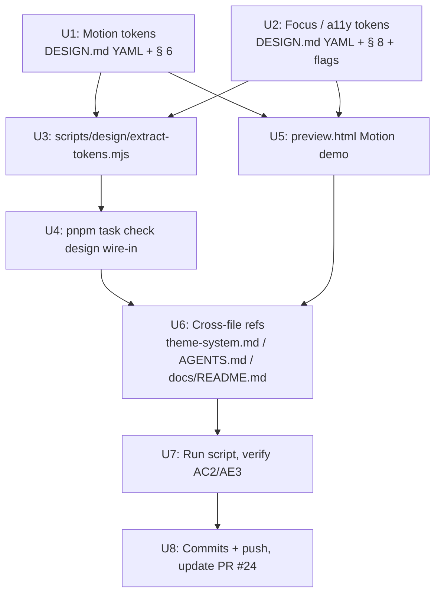

# OnMyAgent DESIGN.md v2 — Plan

## Goal Capsule

**Objective.** Extend `DESIGN.md` from v1 (Stitch v-alpha contract landed in PR #24) with the two highest-ROI capability gaps — **Motion tokens** and **Focus / a11y contract** — and add a **`scripts/design/extract-tokens.mjs`** script wired through **`pnpm task check design`** so drift between `DESIGN.md` YAML and the code token sources becomes locally observable. Preview HTML gains a Motion + Focus demo. This is v2 of the visual contract; v1 authority model (DESIGN.md > code) still applies.

**Product authority.** Documentation + design-system contract change + one new local script under `scripts/design/` + `pnpm task check design` wiring. No runtime code behavior changes in `apps/**`.

**Open blockers.** None. Solo bootstrap synthesis confirmed inferred defaults with the user in chat.

## Product Contract

### Problem Frame

DESIGN.md v1 (PR #24) delivered tokens for colors, typography, radii, spacing, buttons, and 41 atoms + 5 composites + 3 row primitives, but explicitly deferred **motion**, **focus / a11y**, and **any drift-detection tooling** to v2. Today:

- Motion values live only in narrative prose (`§ 6 Depth`) — no concrete tokens for duration / easing, so agent-generated animations pick arbitrary `duration-200 ease-in-out` values inconsistently.
- Focus rings are implemented per-primitive with slightly different rings (`ring-2 ring-primary/40`, `outline outline-2 outline-blue-500`, `focus-visible:ring-ring`) — no semantic contract.
- `reduced-motion` is mentioned in `§ 6` but not encoded as a hard `flag`.
- Drift between `DESIGN.md` YAML and the actual `--dls-*` / `--ow-*` variables in `apps/app/src/app/index.css` is undetectable — the v1 authority model relies on human discipline alone.

### Primary Actor

**AI coding agents** (Codex, Claude, OpenCode) generating UI, with **project owner** as the drift-detection consumer via `pnpm task check design`.

### Core Outcome

- `DESIGN.md` YAML front matter carries `motion:` and `focus:` blocks alongside existing `colors` / `typography` / `rounded` / `spacing` / `buttons` / `components` / `flags`.
- Narrative § 6 (Depth → Motion) becomes concrete: 4 durations × 3 easings + a `prefers-reduced-motion` contract.
- New § 8 (Focus & Accessibility) covers focus-ring token, keyboard-navigation must-haves, screen-reader labels, and reduced-motion.
- `scripts/design/extract-tokens.mjs` runs locally, reads the four code sources + DESIGN.md YAML, and reports drift.
- `pnpm task check design` invokes the script; default report-only, `--strict` for exit-1 (future CI hook).
- `preview.html` / `preview-dark.html` render a Motion demo (fade / slide × 3 easings) and Focus-ring examples so reviewers see the new tokens.

### Positioning

DESIGN.md remains the sole visual authority. This v2 patch adds two token categories and one **tool** (the script) that makes the authority model observable rather than aspirational. `theme-system.md` narrative additions are pointer-only. `AGENTS.md` hard rules extend to include "run `pnpm task check design` before committing UI-token changes".

### Scope

**In-scope (v2)**

- **R1.** Add `motion:` block to `DESIGN.md` YAML: `duration.instant` (0ms), `duration.fast` (120ms), `duration.normal` (200ms), `duration.slow` (320ms); `easing.standard` (default UI), `easing.decisive` (primary actions), `easing.signal` (activity / signal indicators). Include narrative § 6 update with usage guidance per easing.
- **R2.** Add `focus:` block to `DESIGN.md` YAML: `ring-color` (light + dark), `ring-width` (2px), `ring-offset` (2px), `ring-radius` (matches host element radius); add hard flag `focus-ring-required-on-interactive-elements: true` and `reduced-motion-respected: true`.
- **R3.** New DESIGN.md § 8 (Focus & Accessibility) covering: focus-ring token application, minimum contrast ratios (WCAG AA 4.5:1 body / 3:1 large text), keyboard-navigation contracts (Tab / Shift+Tab / Enter / Escape / arrow keys per component category), screen-reader label mandates, `prefers-reduced-motion` behavior.
- **R4.** `scripts/design/extract-tokens.mjs` — Node ESM, reads YAML front matter from `DESIGN.md`, reads `apps/app/src/styles/colors.css` + `apps/app/src/app/index.css` + `apps/app/tailwind.config.ts`, produces a categorized drift report (missing-in-code / missing-in-design / mismatched-value). Report-only by default; `--strict` exits 1 on any drift. `--json` outputs JSON for future tooling.
- **R5.** Wire `design` target into `scripts/cli/task.mjs`'s `checkTargets` map as `{ command: 'node', args: ['scripts/design/extract-tokens.mjs'] }` and update the `printUsage()` string.
- **R6.** Update `preview.html` + `preview-dark.html` with a Motion demo section (fade + slide × 3 easings + reduced-motion note) and a Focus & A11y section (focus-ring examples on button / input / row primitive, keyboard-hint chips).
- **R7.** Update `docs/design/theme-system.md` with pointer sentences for the two new DESIGN.md sections; update `AGENTS.md` UI rule to reference `pnpm task check design`; update `docs/README.md` scripts note.
- **R8.** Update PR #24 body with v2 addendum, or land as a follow-up commit series on the same branch — decided at U8.

**Out-of-scope (v3+ candidates, listed in Deferred to Follow-Up Work)**

- Iconography contract (icon size scale, stroke width, Lucide subset).
- Density modes (compact / default / comfortable row-height differentials).
- Elevation / z-index layer table.
- Data-viz palette (chart / diff / timeline series colors).
- Copy voice guide + i18n key naming convention.
- CI gate wiring (`.github/workflows/*.yml` — human-gated path per AGENTS.md).
- Auto-fix codemod driven by extract-tokens output.
- Domain-specific composites v2 (`extension-card`, `restriction-notice-modal`, `web-unavailable-surface`, `workspace-icon`).
- Storybook / Ladle integration for the preview page.
- Cross-platform titlebar contract for Windows / Linux (currently only macOS).

### Success Criteria

**Primary**

- **AC1.** `DESIGN.md` v2 renders motion and focus tokens in YAML + narrative; `preview.html` visually demonstrates both.
- **AC2.** `pnpm task check design` runs on a clean tree and reports either "no drift" or a categorized drift list (either outcome is acceptable at v2 landing — the tool works).
- **AC3.** Project owner reviews the diff, confirms the motion easing curves feel right for OnMyAgent's voice (not decorative), and confirms the focus-ring width / offset is discoverable but not visually noisy.

**Secondary**

- Running the script from repo root exits 0 in report-only mode even with drift present.
- The script's `--strict` mode exits 1 if any drift exists (verified against a manually-introduced drift, then reverted).
- No changes to any file under `apps/**`, `packages/**`, or `.github/**`.

### Authority Model (unchanged from v1)

DESIGN.md is authoritative. When `pnpm task check design` reports drift, default remediation is to fix code, unless DESIGN.md is itself demonstrably wrong.

### Assumptions (from solo scoping synthesis)

- **AS1.** Easing curves are OnMyAgent-native cubic-bezier values, not Material / iOS spec: `standard = cubic-bezier(0.2, 0, 0, 1)`, `decisive = cubic-bezier(0.3, 0, 0.2, 1)`, `signal = cubic-bezier(0.4, 0, 0.6, 1)`. Owner can override during U1 review; the shape of the token stays.
- **AS2.** Script uses Node native ESM. YAML parsing uses a minimal inline regex-based parser scoped to the DESIGN.md YAML shape (front-matter only, no arbitrary YAML surface); no new npm dependency added. CSS custom-property extraction uses a regex over `--([\w-]+):\s*([^;]+);`. Tailwind config parsing uses dynamic `import()` since the file exports the config object.
- **AS3.** No CI gate wiring in this PR — that touches `.github/workflows/**` which is human-gated per AGENTS.md. Script alias in `package.json` `scripts` block is fine (`task` is already a script; no new top-level script entry added).
- **AS4.** All work commits on the existing `codex/design-md-v1` branch and updates PR #24 rather than opening a second PR — motion / focus tokens and drift script were named as v2 candidates in v1's PR body; keeping them in the same review preserves the reviewer's context.

### Actors

- **A1.** Project owner — arbitrator on motion / focus token values; consumer of `pnpm task check design` output.
- **A2.** AI coding agents — read updated `DESIGN.md` YAML + narrative; consume motion / focus tokens when generating UI.
- **A3.** Future contributors — read § 8 for a11y contracts before shipping user-facing components.

### Key Flows

- **F1. Agent picks motion values.** Agent reads DESIGN.md `motion.duration.fast` (120ms) + `motion.easing.standard` for a hover fade → produces `transition-[opacity] duration-[120ms] ease-[cubic-bezier(0.2,0,0,1)]` or equivalent Tailwind arbitrary → aligns with product voice.
- **F2. Agent adds focus ring.** Agent generates a new custom row primitive → reads `focus.ring-color` + `focus.ring-width` → wraps interactive elements with the shared focus utility class (existing `focus-visible:ring-2 focus-visible:ring-primary/40` pattern extends to consume the token). No per-primitive fork.
- **F3. Owner detects drift.** Owner runs `pnpm task check design` → sees "3 tokens missing in `apps/app/src/app/index.css`" → decides: fix code (default) or update DESIGN.md.

### Acceptance Examples

- **AE1.** Owner asks Codex "add a hover reveal to the assistant card". Codex reads `DESIGN.md` § 6 Motion, picks `duration.fast` + `easing.standard`, generates a transition that matches the app's existing hover feel — no manual correction needed.
- **AE2.** Owner runs `pnpm task check design`. Script outputs: `✓ 42 colors matched · ✓ 10 typography sizes matched · ✓ 6 radii matched · missing in code: --dls-focus-ring, --dls-focus-ring-offset · missing in DESIGN.md YAML: --dls-brand-figma-yellow` (brand palette is an intentional exception, so this is expected residue owner can ignore or filter).
- **AE3.** Owner accidentally sets `--dls-radius-lg: 12px` in `apps/app/src/app/index.css` (DESIGN.md says 10). Runs `pnpm task check design --strict` → exits 1 with clear drift message. Reverts the code change; script passes.

### Constraints

- **C1.** Follow AGENTS.md's multi-collaborator safety: `git status --short --branch` before starting, no `git reset --hard` / `git restore .` / `git clean -fd` / `git push --force`.
- **C2.** Path permissions: `docs/**`, `scripts/**`, `AGENTS.md`, `README.md`, `README-zh.md` are allowlisted. `package.json` is human-gated; **do not modify `package.json`** — the new `pnpm task check design` target is reached through `scripts/cli/task.mjs`'s internal map, not through a new `scripts:` entry.
- **C3.** Node native features only — no new npm deps. Script must run under Node 24 (`.nvmrc`) using ESM.
- **C4.** Even-number typography, no shadows, `mac:titlebar-no-drag`, i18n rules from v1 all still apply.
- **C5.** `pnpm check:forbidden-types` gate — the new script has no TypeScript surface, so this does not apply; but any narrative additions to DESIGN.md YAML that reference forbidden types must reject them.

### Key Technical Decisions

- **KTD1.** **Motion easing = OnMyAgent-native cubic-bezier, three named curves.** Rationale: `standard` covers 90% of UI (hover, reveal, dismiss); `decisive` gives primary CTAs a subtle "commit" acceleration; `signal` gives running / online / activity indicators a symmetric pulse feel that reads as ambient status, not user-initiated motion. Alternatives: Material's `emphasized-decelerate` — rejected as too dramatic for OnMyAgent's flat-first voice; iOS spring — rejected as tuning surface too large for a v2 baseline.
- **KTD2.** **Focus ring = one semantic token, per-primitive application.** Rationale: `--dls-focus-ring` semantic + a shared `focus-visible:` utility centralizes ring color / width / offset without forcing every primitive to import a helper. Alternative: expose a `<FocusRing>` React component — rejected as premature; existing shadcn primitives already all use `focus-visible:` and just need a shared token to consume.
- **KTD3.** **Script parses DESIGN.md YAML with regex, not a YAML library.** Rationale: front-matter shape is fixed (Stitch v-alpha); regex is 20 lines, no dep, deterministic. If the YAML surface grows beyond flat key-value + one-level nested maps, we adopt a real parser. Alternative: `yaml` npm package — rejected because it means a new devDep + `package.json` edit (human gate) for no v2 benefit.
- **KTD4.** **`pnpm task check design` = report-only default, `--strict` for gate.** Rationale: matches v1's authority model — the tool observes drift but does not block until owner confirms the drift is a genuine problem. `--strict` is the CI wire-up seam without adding CI in v2.
- **KTD5.** **Extract-tokens targets only the color / typography / radii / spacing YAML keys.** Rationale: v2 tokens (motion, focus) live in DESIGN.md YAML but their code counterparts are named differently (motion is inline in Tailwind arbitrary values; focus is only in `focus-visible:` utilities) — comparing them programmatically is a v3 problem. Colors + typography + radii + spacing are all named CSS variables, cleanly diffable.

### High-Level Technical Design



U1 and U2 are independent (both touch DESIGN.md but different sections). U3 needs U1 + U2 done so the YAML shape is stable. U4 needs U3. U5 needs U1 + U2. U6 needs U5. U7 needs U4. U8 is the tail.

### Output Structure

```text
onmyagent/
├── DESIGN.md                                    # MODIFY (U1, U2) — YAML + § 6 + § 8
├── AGENTS.md                                    # MODIFY (U6) — UI rule + docs nav
├── README.md                                    # (no change v2 — v1's link still holds)
├── docs/
│   ├── README.md                                # MODIFY (U6) — scripts note
│   ├── design/
│   │   ├── theme-system.md                      # MODIFY (U6) — pointer sentences
│   │   ├── preview.html                         # MODIFY (U5) — Motion + Focus sections
│   │   ├── preview-dark.html                    # MODIFY (U5) — Motion + Focus sections
│   │   └── preview.css                          # MODIFY (U5) — motion-demo + focus-demo CSS
│   └── plans/
│       └── 2026-07-04-002-feat-design-md-v2-plan.md  # this file
└── scripts/
    ├── cli/
    │   └── task.mjs                             # MODIFY (U4) — add design to checkTargets
    └── design/
        └── extract-tokens.mjs                   # NEW (U3) — drift detector
```

## Implementation Units

### U1. Motion tokens

**Goal.** Extend `DESIGN.md` YAML with a `motion:` block and expand § 6 Depth's Motion narrative with concrete usage per easing.

**Requirements.** R1.

**Dependencies.** None.

**Files.** `DESIGN.md` — modify in place.

**Approach.** Insert a `motion:` block after `spacing:` in the YAML front matter, before `buttons:`. Keys: `duration.instant`, `duration.fast`, `duration.normal`, `duration.slow`; `easing.standard`, `easing.decisive`, `easing.signal`. In § 6 Motion, replace the current 4-line motion narrative with a table mapping durations to typical uses (hover fade, sheet reveal, dialog enter, drag settle) and easings to primary uses (default UI, primary CTA commit, activity pulse). Keep the existing "no shadows" / scrollbar narrative untouched.

**Patterns to follow.** Existing YAML shape in `DESIGN.md` uses two-space indent, quoted string values for hex, unquoted integer values for sizes.

**Test scenarios.**

- Test expectation: none — this is a documentation change; validation happens in U7 via `pnpm task check design` reporting `motion` as an intentional-non-CSS-token category.

**Verification.**

- `rg 'motion:' DESIGN.md` shows the new YAML block.
- `rg 'easing.standard' DESIGN.md` shows the easing narrative.
- Owner confirms the three cubic-bezier values feel right for OnMyAgent's voice.

### U2. Focus / a11y tokens

**Goal.** Extend `DESIGN.md` YAML with a `focus:` block, add hard flags for focus-ring-required and reduced-motion-respected, and add § 8 (Focus & Accessibility) as a new top-level narrative section.

**Requirements.** R2, R3.

**Dependencies.** None (parallel with U1).

**Files.** `DESIGN.md` — modify in place. Also updates `apps/app/src/app/index.css` **only if U7 verification finds the token missing** — otherwise no code change. (This is a docs contract; adding the CSS variable to code is subsequent `frontend-primitive-refactor` work if the audit shows it's needed.)

**Approach.** Add `focus:` block after `motion:` in YAML: `ring-color.light` (`#005DFF`), `ring-color.dark` (`#2F7BFF`), `ring-width` (2), `ring-offset` (2). Add to `flags:` block: `focus-ring-required-on-interactive-elements: required`, `reduced-motion-respected: required`. Renumber existing § 8 (Responsive & Platform) → § 9, § 9 (Intentional Exceptions) → § 10, § 10 (Agent Prompt Guide) → § 11. Insert new § 8 (Focus & Accessibility) covering: focus-ring token application on all `button`, `[role="button"]`, `[role="menuitem"]`, `[tabindex="0"]`, and native form controls; WCAG AA contrast targets (4.5:1 body, 3:1 large text); keyboard-navigation contract (Tab / Shift+Tab moves focus; Enter / Space activates; Escape closes dialogs and popovers; arrow keys navigate within menu / list / tab groups); screen-reader label mandate (all icon-only buttons must have `aria-label` or visually-hidden text); `prefers-reduced-motion` (respect the media query; skip enter/exit motion; keep transform-based hover to opacity-only).

**Patterns to follow.** § 6 Depth structure — introduce the concept in one paragraph, then bullet the rules.

**Test scenarios.**

- Test expectation: none — documentation change; the Agent Prompt Guide's "verify against flags" step will pick up the new required flags.

**Verification.**

- `rg 'focus:' DESIGN.md` shows the YAML block.
- `rg '## 8. Focus' DESIGN.md` shows the new section.
- Section numbers 9 / 10 / 11 correctly renumbered.
- `flags:` block contains both new required entries.

### U3. scripts/design/extract-tokens.mjs

**Goal.** Ship a Node ESM script that reads DESIGN.md YAML + three code token sources, produces a categorized drift report, exits 0 in report-only mode and 1 in `--strict` mode when drift exists.

**Requirements.** R4.

**Dependencies.** U1, U2 (YAML shape must be stable before the parser is written).

**Files.**

- `scripts/design/extract-tokens.mjs` — new file.
- `scripts/design/README.md` — brief usage note (optional, folded in if it stays short).

**Approach.**

1. Resolve repo root via `import.meta.url` + relative traversal — the script must be runnable from any cwd.
2. Read `DESIGN.md`, extract the YAML front matter between the two `---` fences, parse it with a scoped regex tokenizer supporting: flat key: value pairs, one-level nested maps (`colors: { light: { primary: ... } }`), quoted-hex values, unquoted integers. Emit a structured JS object.
3. Read `apps/app/src/app/index.css`, extract all `--dls-*` and `--ow-*` custom-property declarations from `:root` (light) and the dark selector (`html.dark`, `.dark`, `[data-theme="dark"]`). Build a `{ light: Map, dark: Map }` structure.
4. Read `apps/app/src/styles/colors.css` — currently the Radix palette source. Note in the report as "raw palette source, not diffed against DESIGN.md YAML" (v2 does not diff Radix scale; v3 could).
5. Read `apps/app/tailwind.config.ts` via dynamic `import()`. Extract `theme.extend.fontSize` / `borderRadius` / `spacing` if present. Build a token map.
6. Diff DESIGN.md YAML against code, categorized into three buckets: `missing-in-code` (in YAML, absent from CSS/tailwind), `missing-in-yaml` (in CSS/tailwind, absent from YAML — this catches brand palette + intentional exceptions), `mismatched-value` (present in both but values differ).
7. Print a categorized report to stdout using unicode box-drawing: `✓ N tokens matched`, then `⚠ missing-in-code: <name> (expected <value>)`, etc.
8. CLI flags: `--strict` (exit 1 on any drift), `--json` (dump raw diff object as JSON to stdout, no human-readable rendering), `--help`.
9. Filter well-known intentional exceptions: `--dls-brand-*` and Radix palette variables are excluded from the `missing-in-yaml` bucket by default (owner can inspect them via `--json --include-exceptions`).

**Execution note.** Write it once, run against the current tree, review the output shape with the owner in U7 before treating it as done. Do not add tests inside `scripts/design/`; this is a diagnostic tool, not a library — behavior verification happens at U7 via an end-to-end run.

**Patterns to follow.**

- `scripts/checks/check-boundaries.mjs` — repo-root resolution, report shape, `--strict` flag pattern.
- `scripts/checks/i18n-audit.mjs` — CLI flag parsing, exit-code discipline.
- `scripts/lib/run-command.mjs` — no dependency on this here (script runs directly), but style consistency.

**Test scenarios.**

- Test expectation: none — this is a diagnostic script; correctness is validated in U7 by running it against the current tree and manually introducing a drift + reverting.

**Verification.**

- `node scripts/design/extract-tokens.mjs --help` prints usage and exits 0.
- `node scripts/design/extract-tokens.mjs` (no flags) runs against the current tree and exits 0, printing a report.
- `node scripts/design/extract-tokens.mjs --json` outputs valid JSON.
- U7 introduces a temporary drift (change one hex in `apps/app/src/app/index.css`), re-runs with `--strict`, confirms exit 1, reverts.

### U4. pnpm task check design wire-in

**Goal.** Expose the script via the canonical `pnpm task check <target>` surface so agents and owner reach it consistently.

**Requirements.** R5.

**Dependencies.** U3.

**Files.** `scripts/cli/task.mjs` — modify.

**Approach.** Add one row to the `checkTargets` map: `['design', { command: 'node', args: ['scripts/design/extract-tokens.mjs'] }]`. Update the `printUsage()` string's `check` line to include `design`. Do not touch `package.json` (human-gated). Verify that `pnpm task check design` invokes the script and that any passthrough args after `--` reach the script (`runCommand` already forwards them per existing convention).

**Patterns to follow.** Existing rows in `checkTargets` — same shape, same style.

**Test scenarios.**

- `pnpm task check design` runs the script and exits with the script's exit code.
- `pnpm task check design -- --strict` passes `--strict` through to the script.
- `pnpm task check` (no target) prints usage that includes `design`.

**Verification.**

- Manual: `pnpm task check design` runs during U7.
- `grep -n "'design'" scripts/cli/task.mjs` shows the new row.
- `pnpm task check 2>&1 | grep design` shows usage.

### U5. preview.html + preview-dark.html Motion + Focus demos

**Goal.** Extend the visual catalog with a Motion demo (opacity fade + translate × 3 easings) and a Focus & A11y demo (focus-ring on button / input / row + keyboard-hint chips).

**Requirements.** R6.

**Dependencies.** U1, U2.

**Files.** `docs/design/preview.html`, `docs/design/preview-dark.html`, `docs/design/preview.css`.

**Approach.**

- Add `preview.css` variables: `--pv-duration-instant/fast/normal/slow`, `--pv-ease-standard/decisive/signal`, `--pv-focus-ring`.
- Add HTML section 8 (Motion): a 3×2 grid of demo tiles — three easings × two motions (fade / slide). Each tile has a Replay button that toggles a CSS class to retrigger the animation. Include a reduced-motion note.
- Add HTML section 9 (Focus & A11y): show focus-ring on button / input / menu row / action row; a keyboard-navigation cheat sheet with kbd-style chips for Tab / Shift+Tab / Enter / Escape / arrow keys.
- Renumber the existing "Do's & Don'ts" from 7 → 10 in both files. Keep footer unchanged.
- `preview-dark.html` mirrors `preview.html` structure; swatch hex values were already dark-specific from v1, so no additional color swaps needed for these new sections (they consume the shared CSS vars which already swap on `[data-theme="dark"]`).

**Patterns to follow.** Existing preview.css structure — `.pv-section`, `.pv-eyebrow`, `.pv-grid-2`, `.pv-btn` variants. Reuse `.pv-btn` for the Replay button.

**Test scenarios.**

- Manual browser check on `preview.html` and `preview-dark.html`:
  - Clicking Replay on each of the 6 motion tiles re-triggers the animation.
  - Tabbing through the Focus & A11y section shows a visible ring on each focusable control.
  - Keyboard-hint chips are readable in both light and dark themes.
- `python3 -c "from html.parser import HTMLParser; ..."` structural parity check passes.

**Verification.**

- Open `docs/design/preview.html` in a browser — Motion tiles animate, Focus rings visible.
- Repeat for `preview-dark.html`.

### U6. Cross-file references

**Goal.** Wire the v2 additions into `theme-system.md`, `AGENTS.md`, and `docs/README.md` so agents / owner discover the new tokens and the drift script.

**Requirements.** R7.

**Dependencies.** U1, U2, U3, U4, U5.

**Files.** `docs/design/theme-system.md`, `AGENTS.md`, `docs/README.md`.

**Approach.**

- `docs/design/theme-system.md`: add two pointer sentences under Motion narrative (already present, extend it) and add a new "Focus & A11y" section pointer to `DESIGN.md § 8`. Also add a note about running `pnpm task check design` under the existing Token Debt Guardrails section.
- `AGENTS.md`: add one bullet under the "UI 与文案" list — "UI token 或 design contract 变更后，运行 `pnpm task check design` 确认 code 与 `DESIGN.md` 无漂移。" Also add `scripts/design/extract-tokens.mjs` to the 文档导航 table with a short description.
- `docs/README.md`: add a row to the Directory Map for `scripts/design/` describing the token-drift script.
- `README.md` / `README-zh.md`: **no change** — v1's DESIGN.md link is sufficient for v2 discovery.

**Patterns to follow.** Same style as v1's PR #24 navigation updates (single-line pointer, no restructure).

**Test scenarios.**

- `rg 'pnpm task check design' AGENTS.md docs/design/theme-system.md docs/README.md` shows the new command references.
- `rg 'DESIGN.md § 8' docs/design/theme-system.md` shows the new pointer.

**Verification.**

- Manual read of the 3 modified files confirms the pointers are discoverable and don't restructure existing content.

### U7. Run extract-tokens script + verify AC2 / AE3

**Goal.** End-to-end verification of the drift script against the current tree, including the strict-mode drift-injection test.

**Requirements.** AC2, AE3 (from Success Criteria).

**Dependencies.** U3, U4.

**Files.** No file changes; verification only. May produce a temporary drift in `apps/app/src/app/index.css` for the AE3 test that MUST be reverted before commit.

**Approach.**

1. `pnpm task check design` from repo root — capture output, confirm exits 0.
2. `pnpm task check design -- --json` — confirm JSON output is valid.
3. `pnpm task check design -- --strict` on the clean tree — exits 0 if no drift, exits 1 if drift is present (both outcomes are acceptable at v2, but note the outcome in the audit).
4. AE3 drift injection: temporarily change `--dls-radius-lg: 10px` → `--dls-radius-lg: 12px` in `apps/app/src/app/index.css`, run `pnpm task check design -- --strict`, confirm exit 1 with clear message, then `git checkout -- apps/app/src/app/index.css` to revert. Verify tree is clean via `git status --short`.

**Execution note.** Do this manually, capture the report in the PR body update at U8. Do not automate.

**Test scenarios.** N/A — this unit *is* the test scenario for U3 and U4.

**Verification.**

- All four steps above completed with expected outcomes.
- Tree is clean after AE3 revert (`git status --short` shows only the intended v2 changes).

### U8. Commits + push, update PR #24

**Goal.** Land v2 as commits on `codex/design-md-v1` and update PR #24 body with the v2 addendum, or (if the reviewer prefers) close #24 and open a fresh PR — decided by owner at U8 kickoff.

**Requirements.** R8.

**Dependencies.** U1–U7.

**Files.** No file changes here — this unit is the git tail.

**Approach.**

- Commit strategy: one commit per U-ID (U1 + U2 combined since both touch DESIGN.md, U3, U4, U5, U6 separate). Plan doc itself lands in U1's commit.
- Push to `origin/codex/design-md-v1`.
- Update PR #24 body with a "v2 addendum" section listing motion / focus / extract-tokens / preview additions, or (if requested) close and open a new PR.

**Test scenarios.** N/A — git operation.

**Verification.**

- `gh pr view 24 --json state,headRefName` shows OPEN and `codex/design-md-v1`.
- `git log --oneline main..HEAD` shows 6 commits: v1's 5 + v2's additions.

## Scope Boundaries

### Deferred to Follow-Up Work

- Fix the 5 `text-[13px]` / `text-[11px]` sites in `personal-local-agent-page.tsx` — belongs in a `frontend-primitive-refactor` pass, not the design contract PR.
- Extract shared `InfoRow` primitive from `weixin-channel-panel.tsx` + `feishu-channel-panel.tsx` + `skills-marketplace-page.tsx` (7 hits) — same reason.
- Sweep `mac:titlebar-no-drag` coverage on the 10 titlebar / sidebar-header pages listed in `.loop/plans/ui-drift-audit.md`.
- If `pnpm task check design` reports a `missing-in-code` for `--dls-focus-ring` (likely — v2 defines the token but code may not yet declare it), the follow-up is to add the CSS variable to `apps/app/src/app/index.css` — human-gated file, done in a separate PR.

### Outside this product's identity

- Iconography contract, density modes, elevation table, data-viz palette, copy voice guide — these are v3+ decisions with separate design bandwidth.
- CI gate wiring (`.github/workflows/**`) — human-gated per AGENTS.md.

## Verification Contract

- `rg 'motion:' DESIGN.md` returns ≥ 1 match.
- `rg 'focus:' DESIGN.md` returns ≥ 1 match.
- `rg '## 8. Focus' DESIGN.md` returns 1 match.
- `pnpm task check design` runs and exits 0 in default mode.
- `pnpm task check design -- --strict` runs on clean tree.
- `grep -n "'design'" scripts/cli/task.mjs` returns 1 match.
- `git diff --check` clean.
- Preview HTML files parse cleanly and render both Motion + Focus sections in a browser.
- No files under `apps/**`, `packages/**`, `.github/**`, `package.json`, or `pnpm-lock.yaml` are modified.

## Definition of Done

- All 8 U-IDs completed.
- Verification Contract fully green.
- 6 commits pushed to `origin/codex/design-md-v1`.
- PR #24 updated (or new PR opened per owner direction at U8).
- U7 AC2 / AE3 outcomes captured in PR body or a follow-up comment.
- Tree clean; no leaked drift-injection edits.

## Sources & Research

- v1 DESIGN.md (PR #24, this branch).
- v1 plan: `docs/plans/2026-07-04-001-feat-design-md-plan.md`.
- User-confirmed v2 candidates from the "还有什么" turn in this session.
- `apps/app/src/app/index.css` — current CSS custom-property source.
- `apps/app/tailwind.config.ts` — current Tailwind theme extension.
- `scripts/checks/check-boundaries.mjs`, `scripts/checks/i18n-audit.mjs` — patterns for Node ESM check scripts.
- `scripts/cli/task.mjs` — `checkTargets` map wire-in pattern.
- getdesign.md's Stitch spec (already applied in v1) — no new spec surface added in v2; motion / focus / a11y are OnMyAgent-native extensions.
